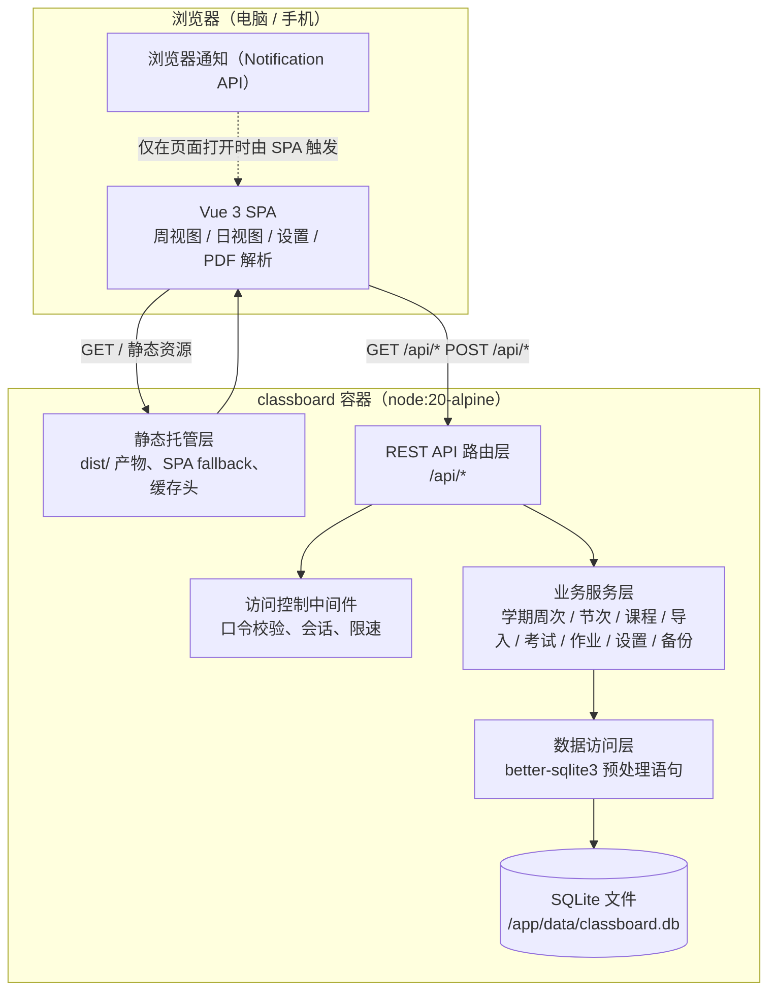
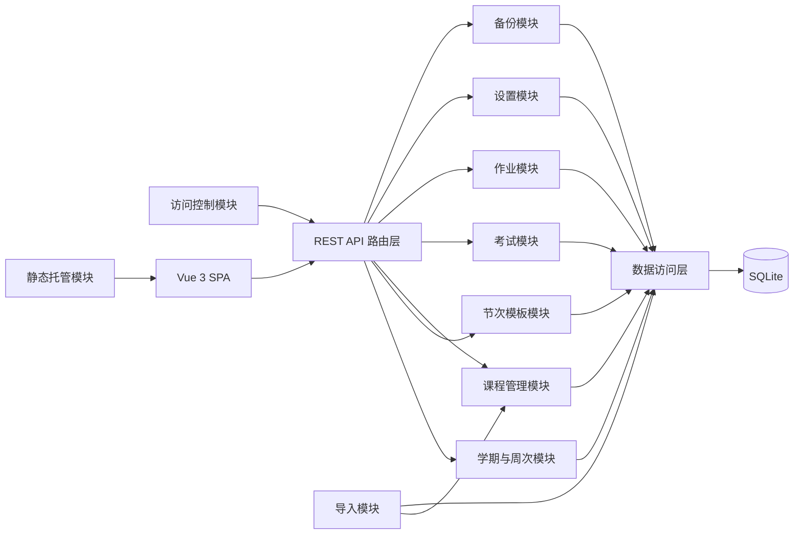
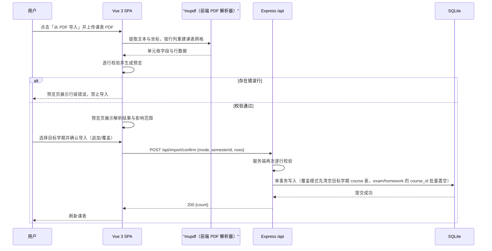
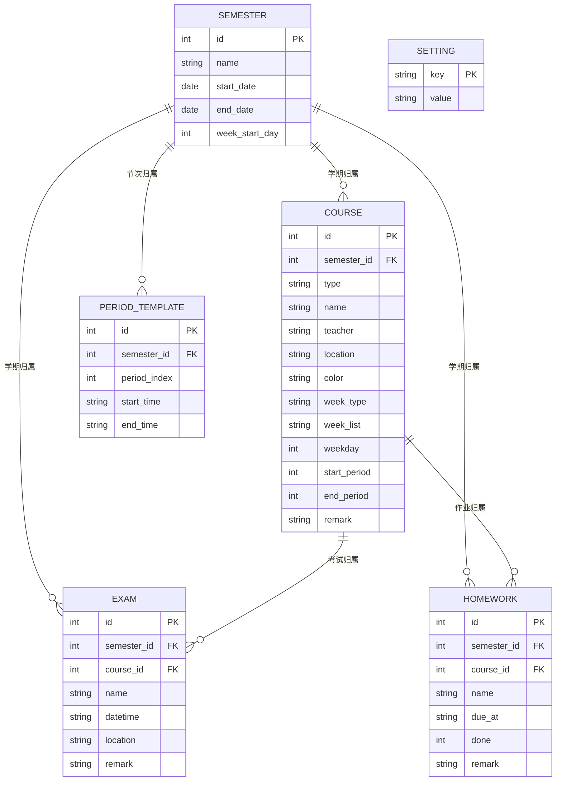

# ClassBoard 技术设计文档

| 项目 | 内容 |
|------|------|
| 产品名称 | ClassBoard（课程表 Web 应用） |
| 文档类型 | 技术设计文档（HLD 与 LLD 结合，Technical Architecture 型） |
| 文档版本 | v1.1 |
| 创建日期 | 2026-08-13 |
| 文档状态 | 待评审 |
| 上游文档 | 《01-PRD-产品需求文档》v1.2 |
| 部署形态 | 单容器 Docker，运行于家用 NAS |
| 实现状态 | v1.1 依据 2026-08-14 代码盘点同步真实实现：后端接口/数据层已全部实现并通过 8 项集成测试；前端 51 项单测全绿；正文以 `[已实现]` / `[部分实现]` / `[未实现]` 标注各设计项的实际落地状态，未实现项见《开发日志》待办 |

## 1 设计概述

### 1.1 目标与范围

本文档描述 ClassBoard 的总体架构与详细设计：系统以单容器 Node.js 服务同时承载 REST API 与 Vue 3 构建产物（SPA），SQLite 单文件数据库落于持久化卷，为家庭单用户提供课表浏览、课程管理、PDF 课表导入、考试作业记录、课程提醒与数据备份能力。

设计范围包括：系统架构与技术选型、服务端与前端模块划分、REST 接口契约、数据库设计、非功能设计、Docker 部署设计与错误处理；支持多学期并存，每学期的课程/考试/作业/节次模板完全独立，当前学期手动切换（假设见 1.3）。设计边界内不做以下事项：多账号与登录体系（PRD 明确单用户，仅保留可选访问口令）、云端同步与服务端推送、移动端原生 App、复制上学期数据（学期数据相互独立，需手动维护）。

### 1.2 上游需求追溯

| PRD 模块 | 本文档对应设计 |
|----------|----------------|
| 5.1-1 课表浏览（周视图） | 2.4 数据流、3.3 前端模块、4.3.2 查询接口、5 数据设计 |
| 5.1-2 课表浏览（日视图） | 同上，日视图由同一查询接口聚合数据派生 |
| 5.1-3 课程管理 | 3.2.5 课程管理模块、4.3.3 课程接口、5.2 course 表 |
| 5.1-4 节次时间模板 | 3.2.4 节次模板模块、4.3.1 接口、5.2 period_template 表 |
| 5.1-5 课程导入 | 2.4 数据流、3.2.6 导入模块、3.3.3 PDF 解析器与手动录入、4.3.5 导入接口、5.3 事务一致性 |
| 5.1-6 课程提醒 | 3.3.2 提醒引擎、4.3.2 查询接口（取今日数据）、6.1 性能 |
| 5.1-7 考试记录 | 3.2.7 考试模块、4.3.4 考试接口、5.2 exam 表 |
| 5.1-8 作业记录 | 3.2.8 作业模块、4.3.5 作业接口、5.2 homework 表 |
| 5.1-9 学期设置 | 3.2.3 学期与周次模块、4.3.1 接口、5.2 semester 表 |
| 5.1-10 数据备份 | 3.2.9 备份模块、4.3.7 备份接口、6.3 备份恢复 |
| 5.1-11 外观设置 | 3.3.1 前端模块、4.3.8 设置接口、5.2 setting 表 |
| 5.1-12 访问控制 | 3.2.2 访问控制模块、4.3.8 设置与访问接口、6.2 安全 |
| 6 非功能（性能） | 6.1 性能设计 |
| 6 非功能（部署） | 7 Docker 部署设计 |
| 6 非功能（数据安全） | 6.2 安全、6.3 备份恢复 |
| 9 验收标准 1-6 | 7 部署设计、4.3 接口、5 数据设计对应验证点 |

### 1.3 关键假设与术语

| 假设 | 说明 |
|------|------|
| 多学期并存 | 学期可增删，每学期拥有独立课程/考试/作业/节次模板；当前学期由 setting 表记录；学期数据按 semester_id 隔离；不支持复制上学期，手动切换当前学期，导入时选择目标学期 `[Data-backed]` |
| 家庭单时区 | 家庭场景时区固定，时间字段一律存本地时间字符串（如 `08:00`、`2026-09-01 09:00`），不做 UTC 转换 `[Expert judgment]` |
| 低并发 | 单家庭场景，预期并发 1-2 个浏览器标签页 `[Hypothesis]`，设计上不做连接池与集群 |
| 课程规模 | 单学期课程 ≤ 200 门、考试作业 ≤ 500 条 `[Hypothesis]`，支撑 SQLite 与单请求聚合的设计 |

| 术语 | 定义 |
|------|------|
| 节次 | 课表的时间单元，如「第 1 节」，其起止时间由节次时间模板定义 |
| 周序号 | 以学期起始日（对齐每周起始日）为基准计算出的第 N 周，从 1 开始 |
| 单双周 | 以周序号奇偶区分的周类型；单周课程只在奇数周显示，双周同理 |
| 全部周课程 | 不受单双周限制的课程（week_type=all） |
| 自定义周 | 显式列举课程出现周序号的规则（week_type=custom） |
| 访问口令 | 可选的门禁口令，开启后访问数据接口需先通过口令校验 |
| 站内提醒 | 应用内铃铛入口展示的提醒，与浏览器通知互为兜底 |
| 当前学期 | 当前操作的学期，由设置（setting 表 current_semester_id）记录，context 接口下发 |
| 持久化卷 | 容器内挂载到宿主机目录的存储，容器重建后数据保留 |

## 2 系统架构

### 2.1 架构风格

系统采用「单容器分层单体」：一个 Node.js 进程内包含静态托管、REST API 路由、业务服务与数据访问四层，前端 SPA 构建产物由同一进程托管，与 `/api` 同源同端口。选择该风格的理由：单用户低并发场景（1.3）不需要独立网关与横向扩展；同源部署消除跨域配置与 Cookie 兼容问题；单容器形态对 NAS 环境是唯一可验证的部署单元（对应 PRD 验收标准 6 的「容器启动成功、重启不丢数据」）；SQLite 单文件数据库与服务进程同生命周期，无外部依赖，家庭数据不出本机的诉求（PRD 需求背景）在物理结构上得到保证。

### 2.2 架构图



图 2-1 ClassBoard 单容器分层架构

图 2-1 说明：浏览器中的 Vue 3 SPA 通过两个入口访问容器：静态资源请求（`GET /` 及其子路径）由静态托管层返回 `dist/` 构建产物，其中带内容哈希的资产文件带一年缓存头，`index.html` 不缓存且对非 `/api` 路径做 SPA fallback（前端路由由 Vue Router history 模式接管）；数据请求统一走 `/api/*`，先经访问控制中间件（仅在开启口令时生效），再进入 REST 路由层分发到对应业务服务。业务服务层各模块只与数据访问层交互，数据访问层通过 better-sqlite3 的参数化预处理语句读写 SQLite 单文件，数据库文件位于持久化卷 `/app/data`，与容器生命周期解耦。浏览器通知不经过网络层：提醒引擎在页面打开时由 SPA 本地调度并直接调用浏览器 Notification API，页面关闭时无提醒（与 PRD 5.6 的实现约定一致）。

### 2.3 组件职责与边界

| 组件 | 拥有 | 不拥有 | 依赖 |
|------|------|--------|------|
| 静态托管层 | dist/ 产物分发、SPA fallback、静态缓存头 | 任何业务数据 | 无 |
| 访问控制中间件 | 口令哈希校验、会话签发与校验、登录限速 | 业务逻辑 | setting 表、内存会话表 |
| REST API 路由层 | 路径到服务的映射、请求解析、统一错误信封 | 业务规则 | 业务服务层 |
| 业务服务层 | 多学期管理（含当前学期标记）与周次计算、课程/考试/作业/设置/导入/备份的业务规则 | HTTP 细节、SQL 拼接 | 数据访问层 |
| 数据访问层 | 建表迁移、预处理语句、事务封装 | 业务规则 | SQLite 文件 |
| Vue 3 SPA | 视图渲染、路由、状态管理、PDF 课表解析、提醒调度 | 数据持久化 | 上述 API |

### 2.4 关键数据流

首次访问：SPA 加载后请求 `GET /api/context`，一次请求带回学期列表、当前学期 id、当前学期的节次模板与设置；随后按设备断点跳转默认视图（手机竖屏进日视图、桌面进周视图，PRD 目标 2），并请求 `GET /api/schedule?date=今天` 得到本周聚合数据用于渲染。该聚合接口在服务端完成周序号计算、单双周/自定义周可见性过滤、节次时间解析与假期判定，前端只做展示，保证「课表渲染 ≤ 300ms」的目标（对应 PRD 性能指标）。

口令开启时的数据流：`/api/context` 与 `/api/access/verify` 保持公开；其余接口在无有效会话时返回 401 AUTH_REQUIRED。SPA 收到 401 后展示口令输入页，校验成功后服务端签发会话 Cookie，后续请求自动携带。

课程导入数据流：前端使用 mupdf（WASM 版）在浏览器内解析课表 PDF 并预览（PRD 5.5 明确前端解析），确认时选择目标学期，把规范化后的行数据连同目标学期 id 提交 `POST /api/import/confirm`，服务端在单事务内完成校验与写入（覆盖模式仅清空目标学期的 course 表数据，该学期已有的 exam/homework 记录保留、course_id 置空），任一错误行导致整体回滚。该流程的详细交互见 4.3.5 的时序图。

### 2.5 技术选型与理由

| 选型 | 理由 | 服务的需求 |
|------|------|------------|
| node:20-alpine 单容器 | 与前端构建产物同进程托管，镜像约 50-70 MB，Alpine 在 NAS 常见（含 ARM）上镜像拉取快 | PRD 6 部署（x86/ARM、NAS） |
| Express | Node 生态事实标准路由框架，中间件机制适配访问控制与静态托管的组合 | 4 接口设计、3.2.2 |
| better-sqlite3 | 同步 API 使单用户业务逻辑无回调嵌套；自带预处理语句防注入；零外部服务，数据即本地文件 | PRD 需求背景（数据不出本机）、6.1 性能 |
| SQLite WAL 模式 | 读写不互斥，配合低并发场景；单文件 `.db` 便于卷级备份 | 6.1、6.3 |
| Vue 3 + Vite | 组件化与响应式满足周/日视图高频重渲染；Vite 产出带哈希的小体积静态包，构建配置简单 | PRD 目标 2、6 性能 |
| Pinia + Vue Router | 状态管理与路由的标准配套；路由级代码分割控制首屏体积 | 3.3.1 |
| mupdf（WASM） | 在浏览器内提取 PDF 文本与坐标元数据，按表格线/坐标重建课表网格；无需服务端 PDF 依赖；`[实测]` 正方课表 PDF 的 STSong-Light 字体无 ToUnicode 映射（GBK 编码），pdfjs-dist 的 getTextContent 提取为空，而 mupdf 可正确解码，故弃用 pdfjs-dist 改用 mupdf | PRD 5.5（前端解析）、6 性能 |
| Node 内置 crypto（scrypt） | 口令哈希与校验全部用内置模块完成，不引入额外原生依赖，避免 Alpine 编译面 | 6.2 安全 |
| compression 中间件 | 对静态资产启用 gzip，压缩率约 60-70%，服务首屏 ≤ 2s 目标 | 6.1 性能 |
| 自研轻量 UI 组件 + CSS 变量 | 不引入 Element Plus 等重型组件库，包体更小；统一使用设计语言 v2.0 的 CSS 变量 token，便于整体风格维护 | 6 性能、PRD 5.1-11 |

以上库的版本号在实现时锁定并写入 package-lock.json；本设计不承诺具体版本，除既定决策外标注 `[To be confirmed]`。

## 3 模块设计

### 3.1 模块划分与依赖



图 3-1 服务端模块依赖图

图 3-1 说明：所有业务模块只依赖数据访问层，依赖方向单向无环。REST API 路由层是唯一 HTTP 入口，负责将请求分发给对应业务模块；访问控制模块以中间件形式挂在路由层之前，不直接依赖任何业务模块。导入模块复用课程管理模块的写入能力（同一校验与写入函数），保证「手动编辑」与「导入」两条路径行为一致。静态托管模块与前端 SPA 之间是产物文件关系，不构成运行时调用。

### 3.2 服务端模块

以下每个模块的责任均可用一句话描述，超出该句范围的职责划分到其他模块。

**3.2.1 静态托管模块**

| 项 | 内容 |
|----|------|
| 责任 | 分发 `dist/` 静态产物并对非 `/api` 路径做 SPA fallback |
| 输入 | HTTP GET 请求 |
| 输出 | 静态文件响应（带缓存头）或 `index.html` |
| 依赖 | 前端构建产物 |
| 边界 | 不处理任何数据请求，不写日志业务内容 |

**3.2.2 访问控制模块**

| 项 | 内容 |
|----|------|
| 责任 | 在口令开启时校验请求会话，提供口令的设置、校验与登出 |
| 输入 | Cookie（`classboard_session`）、`/api/access/*` 请求体 |
| 输出 | 放行或 401/403/429 响应；签发/销毁会话 |
| 依赖 | setting 表（口令哈希）、内存会话表 |
| 边界 | 不参与业务数据校验；不提供找回机制（PRD 5.10 无找回，遗忘时删除 setting 表中口令哈希行即可重置） |

**3.2.3 学期与周次模块**

| 项 | 内容 |
|----|------|
| 责任 | 管理多个学期（增删改查）、维护当前学期标记、计算任意日期在指定学期内的周序号、单双周与假期状态 |
| 输入 | 学期管理请求（增删改查、设置当前学期）、任意日期 |
| 输出 | 学期对象列表、当前学期 id、周序号、isOddWeek、isHoliday |
| 依赖 | semester 表、setting 表（当前学期标记） |
| 边界 | 不感知课程与节次；删除学期需级联处理其课程/考试/作业/节次模板数据（删除前二次确认，级联删除该学期全部数据） |

周序号算法（供 4.3.2 聚合接口调用，在指定学期内计算）：设该学期起始日为 S、每周起始日对齐偏移为 `offset = (date.getDay() - weekStartDay + 7) % 7`，则 `weekNumber = floor((date - S + offset) / 7天) + 1`；`date < S` 或 `date > 该学期结束日` 时返回 isHoliday=true，周序号为空。

**3.2.4 节次模板模块**

| 项 | 内容 |
|----|------|
| 责任 | 每个学期各自维护节次行（可增删改），行数不固定，按 period_index 排序 |
| 输入 | 节次行的增删改请求（携带 semesterId） |
| 输出 | 节次列表（按 period_index 升序） |
| 依赖 | period_template 表 |
| 边界 | 不计算课程可见性；删除行后对剩余行重新排序 period_index，同学期内不可重复 |

**3.2.5 课程管理模块**

| 项 | 内容 |
|----|------|
| 责任 | 维护课程及其周内安排（星期、起止节次、周规则）；所有课程归属某学期（semester_id），周可见性计算基于该学期周次设置；手动录入课程复用本模块创建能力，不经过导入事务 |
| 输入 | 课程增删改查请求（携带 semesterId）、导入确认行数据、手动录入请求（同创建接口） |
| 输出 | 课程对象；周可见性判定结果（供聚合接口使用） |
| 依赖 | course 表；节次模板（时间解析） |
| 边界 | 不拦截时间重叠（PRD 5.2 明确后导入者错位显示，冲突只在详情标注，不做拦截） |

周可见性规则：设当前周序号为 W，课程按 week_type 判定——all：week_list 为空则始终可见，否则 W 属于 week_list；odd：W 为奇数且（week_list 为空或 W 属于 week_list）；even：W 为偶数且同理；custom：W 属于 week_list。该规则同时服务周视图过滤与「关闭单双周过滤」设置（关闭后 odd/even 课程按 week_list 或全部周显示）。

**3.2.6 导入模块**

| 项 | 内容 |
|----|------|
| 责任 | 接收前端解析后的行数据，服务端再校验并写入指定学期，按追加/覆盖模式事务写入；覆盖模式仅清空目标学期的 course 表数据，该学期已有的 exam/homework 记录保留、course_id 置空（ON DELETE SET NULL 语义，批量置空） |
| 输入 | `POST /api/import/confirm` 的 rows、mode 与 semesterId |
| 输出 | 导入成功行数或行级错误明细 |
| 依赖 | 课程管理模块、course 表 |
| 边界 | 不做 PDF 解析（PRD 规定前端解析）；服务端仅接收规范化行数据，不持有解析器 |

**3.2.7 考试模块**

| 项 | 内容 |
|----|------|
| 责任 | 维护考试记录（归属某学期，可关联课程，可按时间范围查询） |
| 输入 | 考试增删改查请求（携带 semesterId） |
| 输出 | 考试对象列表 |
| 依赖 | exam 表；course 表（外键，删除课程时置空） |
| 边界 | 不参与周次计算，按绝对日期时间排序展示 |

**3.2.8 作业模块**

| 项 | 内容 |
|----|------|
| 责任 | 维护作业记录（归属某学期）与完成状态切换 |
| 输入 | 作业增删改查请求（携带 semesterId）、完成状态切换请求 |
| 输出 | 作业对象列表 |
| 依赖 | homework 表；course 表（外键，删除课程时置空） |
| 边界 | 不发送任何通知，提醒只发生在「今天」查询结果之上 |

**3.2.9 设置模块**

| 项 | 内容 |
|----|------|
| 责任 | 读写单双周过滤、课程提醒、实验课提醒、作业提醒等非业务设置 |
| 输入 | 设置读写请求 |
| 输出 | 设置对象（不包含口令哈希） |
| 依赖 | setting 表 |
| 边界 | 口令哈希由访问控制模块独占读写，设置模块不接触 |

**3.2.10 备份模块**

| 项 | 内容 |
|----|------|
| 责任 | 导出全量数据为 JSON、导入 JSON 全量恢复 |
| 输入 | 导出请求、恢复上传文件 |
| 输出 | JSON 文件流；恢复结果统计 |
| 依赖 | 全部业务模块的表 |
| 边界 | 不做定时任务（PRD M3 可选自动备份）；恢复前自动生成一份当前数据的导出文件作为安全网 |

### 3.3 前端模块

**3.3.1 应用骨架与状态管理** `[已实现]`：Vue Router 四个视图——`/week`（周视图）、`/day`（今天）、`/matters`（事项：考试/实验/作业三 Tab）、`/settings`（设置），`/` 重定向到 `/week`；路由级动态导入使各视图按需加载。状态管理为**单一 `scheduleStore`**（`stores/schedule.ts`，与文档早期「四个 store」设想不同，实际合并为 1 个）：持有学期列表/当前学期/节次/课程/周上下文与 `weekExams`/`weekHomework` 管道（供考试/作业接入使用，当前前端仍以 mock 展示）；其中 `scheduleStore` 持有聚合接口返回的周数据作为渲染唯一来源，避免多接口拼装导致的时序不一致。视图按当前学期拉取数据，设置页包含学期管理（切换/编辑已实现，新建/删除未实现）。新课程颜色分配在前端 `scheduleStore` 完成：按录入顺序从 8 色预设中轮询，课程名（name）相同的复用已有颜色，后端仅存色值 `[已实现]`；课程颜色手动修改 `[未实现]`。`index.html` 注册 Web App Manifest（含 192/512 图标）`[未实现]`（当前仅 `theme-color` meta 与 `public/icons.svg` 资产）。周视图打印与导出 PNG `[未实现]`（设计见 UI 文档 4.7，均为纯前端实现，无对应后端接口）。

**3.3.2 提醒引擎** `[未实现]`：设计为页面打开时，从 `GET /api/schedule?date=今天` 结果中取出当日课程（已含解析后的起止时间）与提醒设置，为每节满足条件（提醒时机=每节课，或仅当天首课）的课程注册 `setTimeout`，到点调用 Notification API（权限未授予时不发起，转入站内铃铛）；同时维护站内铃铛列表，两条通道互为兜底（对应 PRD 5.6 与风险表「通知权限被关闭」的应对）。课程提醒按课程类型分流：普通课由 `reminder` 设置控制，实验课（type='lab'）由独立的 `labReminder` 设置控制，两者互不影响、均默认关闭。站内铃铛入口：桌面端为顶栏图标（未读角标，UI 已有下拉骨架、数据为 mock），移动端并入日课页摘要条；提醒内容含上课与作业截止两类（作业取当日查询结果中的 homework 列表，按 homeworkReminder 设置生成）；提醒数据由前端基于当日查询结果生成，无需额外接口。页面关闭或路由离开时清除全部定时器。后端提醒设置字段（`reminder`/`labReminder`/`homeworkReminder`）已实现并纳入备份恢复，等待前端提醒引擎落地。

**3.3.3 PDF 解析器与手动录入**：使用 mupdf（WASM 版，浏览器内运行）完成「上传 PDF → 提取文本与坐标 → 按行列重建课表网格 → 解析单元格字段 → 行级校验」流程，与后端共享同一套字段约束定义（名称 1-50 字、星期 1-7、节次在目标学期模板范围内（默认 1-12）且结束≥开始等）。选型说明 `[Data-backed]`：样本《严子辰(2026-2027-1)课表.pdf》正文使用 STSong-Light 字体且无 ToUnicode 映射（字符以 GBK 编码直接绘制），pdfjs-dist 的 getTextContent 对该文件返回空文本，实测 mupdf 可完整解码，故解析库定为 mupdf（懒加载，独立 chunk 约 10 MB，仅「从 PDF 导入」时加载）。PDF 解析规则基于该真实样本解析得出：样表 3 页 A4 横向（842×595pt），第 1 页为课表主体，表头为「时间段 | 节次 | 星期一~星期日」，行分组为上午(1-4 节)/下午(5-8 节)/晚上(9-10 节)共 10 节；单元格字段以 `/` 分隔、`:` 键值，格式为「课程名（可带 ▲/●）/ (开始-结束节)周次规则/场地:xx/教师:xx/教学班:xx/教学班组成:xx/考核方式:xx/选课备注:/课程学时组成:讲课:N,实验:M/周学时:N/总学时:N/学分:N」；周次规则形式 `1-16周`、`1-15周(单)`、`1-8周,10-16周(双)`、`1-10周,12周,15周`、`6-13周`，解析时展开为 weekType（'all'/'odd'/'even'/'custom'）与 weekList 数组；课程类型判定（`[Data-backed]` 开发确认，会话 9）：PDF 导入课程**一律 type='course'**（教务 PDF 仅提示课程含实验学时，不代表该节课是实验课），实验学时信息保留进备注，实验课由用户手动录入；跨节次单元格按 (开始-结束节) 展开。第 2 页「实践课程：」「其他课程：」汇总行作为参考提示展示，不强制解析 `[Expert judgment]`。顶栏「导入课程」为下拉入口，含「从 PDF 导入」与「手动录入」两项：手动录入直接打开课程编辑弹窗（含课程类型选择），保存即调用 `POST /api/courses` 创建课程，不经过 PDF 解析与预览流程；两者互相独立，均写入当前/所选学期。

**3.3.4 主题与断点**：主题固定为清新浅色（`color-scheme: light`，本期无暗色模式，见设计语言文档 v2.0 第 11 节）；断点工具返回设备类别供默认视图跳转与课表横向滚动逻辑使用（手机端周课表始终显示 7 天，横向滚动查看，PRD 5.2）。

## 4 接口设计

### 4.1 通用约定

**4.1.1 基础约定**：所有接口位于 `/api` 前缀之下，请求与响应均为 `application/json`（下载类接口除外，见各契约）；日期时间为本地时间字符串；会话 Cookie 名为 `classboard_session`（HttpOnly、SameSite=Lax、Path=/）；开启访问口令后，除 4.3.8 的 `POST /api/access/verify` 与 `GET /api/context`（降级响应）外，所有接口要求有效会话，否则返回 401 AUTH_REQUIRED。

**4.1.2 统一错误信封**：所有失败响应体为

```json
{ "code": "VALIDATION_ERROR", "message": "星期取值无效", "details": [ { "field": "weekday", "message": "取值必须为 1-7" } ] }
```

HTTP 状态码与 code 的映射：

| HTTP | code | 触发条件 |
|------|------|----------|
| 400 | VALIDATION_ERROR | 字段校验失败，details 标注字段或行号 |
| 400 | BAD_FILE | 备份文件格式不符 |
| 401 | AUTH_REQUIRED | 口令开启且无有效会话 |
| 403 | ACCESS_DENIED | 口令错误 |
| 404 | NOT_FOUND | 资源不存在 |
| 413 | FILE_TOO_LARGE | 上传超过大小限制 |
| 429 | RATE_LIMITED | 口令校验超频 |
| 500 | INTERNAL_ERROR | 未预期异常（不输出堆栈） |

**4.1.3 对象 Schema**（后续契约直接引用）

| 对象 | 字段 |
|------|------|
| Semester | `id:number`、`name:string(1-50)`、`startDate:string(YYYY-MM-DD)`、`endDate:string(YYYY-MM-DD)`、`weekStartDay:1|7` |
| Period | `id:number`、`semesterId:number`、`index:number(≥1)`、`startTime:string(HH:mm)`、`endTime:string(HH:mm)` |
| Course | `id:number`、`semesterId:number`、`type:'course'\|'lab'`、`name:string(1-50)`、`teacher:string(0-30)`、`location:string(0-50)`、`color:string（8 色预设色名之一）`、`weekType:'all'\|'odd'\|'even'\|'custom'`、`weekList:number[]\|null`、`weekday:1-7`、`startPeriod:1-12`、`endPeriod:1-12(≥startPeriod)`、`remark:string(0-200)` |
| Exam | `id:number`、`semesterId:number`、`courseId:number\|null`、`name:string(1-50)`、`datetime:string(YYYY-MM-DDTHH:mm)`、`location:string(0-50)`、`remark:string(0-200)` |
| Homework | `id:number`、`semesterId:number`、`courseId:number\|null`、`name:string(1-50)`、`dueAt:string(YYYY-MM-DDTHH:mm)`、`done:boolean`、`remark:string(0-200)` |
| Settings | `showOddEvenFilter:boolean`、`reminder:{enabled:boolean, mode:'every'\|'first', advanceMinutes:5\|10\|15\|30}`、`labReminder:{enabled:boolean, mode:'every'\|'first', advanceMinutes:5\|10\|15\|30}`、`homeworkReminder:{enabled:boolean, advanceDays:1\|2\|3}` |
| ImportRow | `name:string(1-50)`、`type?:'lab'`、`teacher?`、`location?`、`weekday:1-7`、`weeks:number[](1-30)`、`startPeriod:1-12`、`endPeriod:1-12(≥startPeriod)`、`color?:string` |

注：`reminder.enabled` 默认 `false`（提醒默认关闭，首次使用在设置页引导开启）；Period 行数不固定，默认 12 节（含晚自习），时间见 4.3.1。

### 4.2 接口清单

| # | 方法与路径 | 用途 |
|---|-----------|------|
| 1 | POST /api/access/verify | 口令校验，签发会话 |
| 2 | POST /api/access/logout | 销毁会话 |
| 3 | POST /api/access/enable | 开启访问口令 |
| 4 | POST /api/access/disable | 关闭访问口令（需验证当前口令） |
| 5 | GET /api/context | 应用启动聚合（学期列表/当前学期/节次/设置） |
| 6 | GET /api/schedule?date= | 指定日期所在周聚合数据（周/日视图与提醒共用） |
| 7 | GET /api/semesters | 学期列表 |
| 8 | POST /api/semesters | 创建学期 |
| 9 | PUT /api/semesters/:id | 更新学期 |
| 10 | DELETE /api/semesters/:id | 删除学期（级联清理该学期全部数据） |
| 11 | PUT /api/semesters/current | 设置当前学期（body `{id}`） |
| 12 | GET /api/periods?semesterId= | 读指定学期节次模板 |
| 13 | POST /api/periods | 新增节次行（body 含 semesterId/startTime/endTime） |
| 14 | PUT /api/periods/:id | 修改节次行起止时间 |
| 15 | DELETE /api/periods/:id | 删除节次行（剩余行重新排序） |
| 16 | GET /api/courses?semesterId=&type= | 课程列表（按学期与类型过滤） |
| 17 | POST /api/courses | 新增课程（手动录入与周视图空白格新增共用） |
| 18 | GET /api/courses/:id | 课程详情 |
| 19 | PUT /api/courses/:id | 更新课程 |
| 20 | DELETE /api/courses/:id | 删除课程 |
| 21 | GET /api/exams?semesterId= | 考试列表（按时间倒序，按学期过滤） |
| 22 | POST /api/exams | 新增考试 |
| 23 | PUT /api/exams/:id | 更新考试 |
| 24 | DELETE /api/exams/:id | 删除考试 |
| 25 | GET /api/homework?status=&semesterId= | 作业列表（按学期过滤） |
| 26 | POST /api/homework | 新增作业 |
| 27 | PUT /api/homework/:id | 更新作业 |
| 28 | PATCH /api/homework/:id/done | 切换完成状态 |
| 29 | DELETE /api/homework/:id | 删除作业 |
| 30 | POST /api/import/confirm | 确认导入（追加/覆盖，指定目标学期） |
| 31 | GET /api/backup | 导出全量 JSON |
| 32 | POST /api/backup/restore | 导入 JSON 恢复 |
| 33 | GET /api/settings | 读设置 |
| 34 | PUT /api/settings | 写设置 |

### 4.3 接口契约

#### 4.3.1 学期、节次与启动聚合

| 字段 | 值 |
|------|-----|
| 操作 | `GET /api/context` |
| 用途 | 应用启动一次拉取学期列表、当前学期、节次模板与设置 |
| 认证 | 无（口令开启且未登录时返回降级响应） |
| 成功响应 | 200：`{ semesters: Semester[], currentSemesterId: number|null, periods: Period[], settings: Settings & { accessEnabled: boolean } }`（periods 为当前学期的节次模板，未设当前学期时为空数组）；口令开启且未登录：200：`{ accessRequired: true }`（不含数据） |
| 错误码 | 无（任何情况下均 200） |

| 字段 | 值 |
|------|-----|
| 操作 | `GET /api/schedule?date=YYYY-MM-DD` |
| 用途 | 返回 date 所在周的周上下文与可见课程、考试、作业，供周/日视图与提醒引擎使用（基于当前学期） |
| 认证 | 会话（口令开启时） |
| 查询参数 | `date`（可选，缺省为服务器当天；格式非法返回 400） |
| 成功响应 | 200：`{ week: { weekNumber: number|null, isOddWeek: boolean, isHoliday: boolean, startDate, endDate, semester: Semester|null }, courses: [{ id, type, name, teacher, location, color, weekday, startPeriod, endPeriod, weekType, weekList, startTime, endTime, remark }], exams: Exam[], homework: Homework[] }` `[已实现]`（course 对象实际额外返回 `weekType`/`weekList` 字段）；未设置当前学期时 weekNumber 为 null 且 courses/exams/homework 均为**空数组**（实际实现，非「课程按全部周返回」）；isHoliday 为 true 时 courses 为空数组（前端课表置灰显示「假期」，PRD 5.8） |
| 错误码 | 400 VALIDATION_ERROR |

| 字段 | 值 |
|------|-----|
| 操作 | `GET /api/semesters` |
| 用途 | 学期列表 |
| 认证 | 会话（口令开启时） |
| 成功响应 | 200：`Semester[]`（按 startDate 升序） |
| 错误码 | 无 |

| 字段 | 值 |
|------|-----|
| 操作 | `POST /api/semesters` |
| 用途 | 创建学期；创建后自动生成默认 12 行节次模板（时间见节末注记）并设为当前学期 |
| 认证 | 会话（口令开启时） |
| 请求体 | `{ name, startDate, endDate, weekStartDay }`，全部必填 |
| 成功响应 | 201：`Semester`（含服务端生成 id） |
| 错误码 | 400 VALIDATION_ERROR（startDate > endDate、weekStartDay 非 1 或 7、name 重名） |

| 字段 | 值 |
|------|-----|
| 操作 | `PUT /api/semesters/:id` |
| 用途 | 更新学期（名称、起止日期、周起始日） |
| 认证 | 会话（口令开启时） |
| 请求体 | 同 `POST /api/semesters` |
| 成功响应 | 200：`Semester` |
| 错误码 | 400 VALIDATION_ERROR；404 NOT_FOUND |

| 字段 | 值 |
|------|-----|
| 操作 | `DELETE /api/semesters/:id` |
| 用途 | 删除学期（前端二次确认后级联删除该学期全部课程/考试/作业/节次模板） |
| 认证 | 会话（口令开启时） |
| 成功响应 | 204 无响应体；被删学期为当前学期时自动切换到剩余学期中最早的一个，无学期时 currentSemesterId 置空 |
| 错误码 | 404 NOT_FOUND |

| 字段 | 值 |
|------|-----|
| 操作 | `PUT /api/semesters/current` |
| 用途 | 设置当前学期 |
| 认证 | 会话（口令开启时） |
| 请求体 | `{ id: number }` |
| 成功响应 | 200：`{ currentSemesterId: number }` |
| 错误码 | 404 NOT_FOUND（id 不存在） |

| 字段 | 值 |
|------|-----|
| 操作 | `GET /api/periods?semesterId=` |
| 用途 | 读指定学期节次模板 |
| 认证 | 会话（口令开启时） |
| 查询参数 | `semesterId`（可选，缺省用当前学期） |
| 成功响应 | 200：`Period[]`（按 index 升序） |
| 错误码 | 404 NOT_FOUND（学期不存在） |

| 字段 | 值 |
|------|-----|
| 操作 | `POST /api/periods` |
| 用途 | 新增一节次行（追加到该学期末尾，period_index 顺延） |
| 认证 | 会话（口令开启时） |
| 请求体 | `{ semesterId, startTime, endTime }` |
| 成功响应 | 201：`Period` |
| 错误码 | 400 VALIDATION_ERROR（时间格式非法、endTime ≤ startTime）；404 NOT_FOUND（学期不存在） |

| 字段 | 值 |
|------|-----|
| 操作 | `PUT /api/periods/:id` |
| 用途 | 修改节次行起止时间 |
| 认证 | 会话（口令开启时） |
| 请求体 | `{ startTime, endTime }` |
| 成功响应 | 200：`Period` |
| 错误码 | 400 VALIDATION_ERROR；404 NOT_FOUND |

| 字段 | 值 |
|------|-----|
| 操作 | `DELETE /api/periods/:id` |
| 用途 | 删除节次行（该学期剩余行 period_index 重新排序） |
| 认证 | 会话（口令开启时） |
| 成功响应 | 204 无响应体 |
| 错误码 | 404 NOT_FOUND |

节次模板默认值（`[Data-backed]`）：首次创建学期时自动生成 12 行，时间依次为 08:00-08:45、08:55-09:40、10:00-10:45、10:55-11:40、14:00-14:45、14:55-15:40、16:00-16:45、16:55-17:40、19:00-19:45、19:55-20:40、20:50-21:35、21:45-22:30（含晚自习）；行数不固定，可在设置页增删。

#### 4.3.2 课程接口

| 字段 | 值 |
|------|-----|
| 操作 | `GET /api/courses?semesterId=&type=` |
| 用途 | 课程列表（管理页、周视图过滤、事项页实验子 Tab 使用） |
| 认证 | 会话（口令开启时） |
| 查询参数 | `semesterId`（可选，缺省当前学期）；`type`（可选，`course`/`lab`，缺省返回全部） |
| 成功响应 | 200：`Course[]`（按 weekday、startPeriod 排序） |
| 错误码 | 400 VALIDATION_ERROR（type 取值非法） |

| 字段 | 值 |
|------|-----|
| 操作 | `POST /api/courses` |
| 用途 | 新增课程（归属指定学期，缺省当前学期） |
| 认证 | 会话（口令开启时） |
| 请求体 | `Course` 去掉 id 后的全部字段（semesterId 可省略，缺省当前学期）；weekType=custom 时 weekList 必填（1-30 内去重），其余类型可省略（null） |
| 成功响应 | 201：`Course`（含服务端生成 id） |
| 错误码 | 400 VALIDATION_ERROR（name 空、weekday/节次越界、endPeriod < startPeriod、weekList 含越界值） |

| 字段 | 值 |
|------|-----|
| 操作 | `GET /api/courses/:id` |
| 用途 | 课程详情 |
| 认证 | 会话（口令开启时） |
| 成功响应 | 200：`Course` |
| 错误码 | 404 NOT_FOUND |

| 字段 | 值 |
|------|-----|
| 操作 | `PUT /api/courses/:id` |
| 用途 | 更新课程（整体替换） |
| 认证 | 会话（口令开启时） |
| 请求体 | 同 `POST /api/courses` |
| 成功响应 | 200：`Course` |
| 错误码 | 400 VALIDATION_ERROR；404 NOT_FOUND |

| 字段 | 值 |
|------|-----|
| 操作 | `DELETE /api/courses/:id` |
| 用途 | 删除课程（关联考试/作业的 courseId 置空，记录保留） |
| 认证 | 会话（口令开启时） |
| 成功响应 | 204 无响应体 |
| 错误码 | 404 NOT_FOUND |

#### 4.3.3 考试接口

| 字段 | 值 |
|------|-----|
| 操作 | `GET /api/exams?semesterId=` |
| 用途 | 考试列表 |
| 认证 | 会话（口令开启时） |
| 查询参数 | `semesterId`（可选，缺省当前学期） |
| 成功响应 | 200：`Exam[]`（按 datetime 倒序） |
| 错误码 | 无 |

| 字段 | 值 |
|------|-----|
| 操作 | `POST /api/exams` |
| 用途 | 新增考试（归属指定学期，缺省当前学期） |
| 认证 | 会话（口令开启时） |
| 请求体 | `{ semesterId?, courseId?, name, datetime, location?, remark? }` |
| 成功响应 | 201：`Exam` |
| 错误码 | 400 VALIDATION_ERROR（name 空、datetime 非法、courseId 不存在时 details 标注 courseId） |

| 字段 | 值 |
|------|-----|
| 操作 | `PUT /api/exams/:id` |
| 用途 | 更新考试 |
| 认证 | 会话（口令开启时） |
| 请求体 | 同 `POST /api/exams` |
| 成功响应 | 200：`Exam` |
| 错误码 | 400 VALIDATION_ERROR；404 NOT_FOUND |

| 字段 | 值 |
|------|-----|
| 操作 | `DELETE /api/exams/:id` |
| 用途 | 删除考试 |
| 认证 | 会话（口令开启时） |
| 成功响应 | 204 无响应体 |
| 错误码 | 404 NOT_FOUND |

#### 4.3.4 作业接口

| 字段 | 值 |
|------|-----|
| 操作 | `GET /api/homework?status=open\|done&semesterId=` |
| 用途 | 作业列表 |
| 认证 | 会话（口令开启时） |
| 查询参数 | `status`（可选，缺省返回全部）；`semesterId`（可选，缺省当前学期） |
| 成功响应 | 200：`Homework[]`（按 dueAt 倒序） |
| 错误码 | 400 VALIDATION_ERROR（status 非法） |

| 字段 | 值 |
|------|-----|
| 操作 | `POST /api/homework` |
| 用途 | 新增作业（归属指定学期，缺省当前学期） |
| 认证 | 会话（口令开启时） |
| 请求体 | `{ semesterId?, courseId?, name, dueAt, done?=false, remark? }` |
| 成功响应 | 201：`Homework` |
| 错误码 | 400 VALIDATION_ERROR |

| 字段 | 值 |
|------|-----|
| 操作 | `PUT /api/homework/:id` |
| 用途 | 更新作业 |
| 认证 | 会话（口令开启时） |
| 请求体 | 同 `POST /api/homework` |
| 成功响应 | 200：`Homework` |
| 错误码 | 400 VALIDATION_ERROR；404 NOT_FOUND |

| 字段 | 值 |
|------|-----|
| 操作 | `PATCH /api/homework/:id/done` |
| 用途 | 切换完成状态（列表勾选交互） |
| 认证 | 会话（口令开启时） |
| 请求体 | `{ done: boolean }` |
| 成功响应 | 200：`{ id, done }` |
| 错误码 | 400 VALIDATION_ERROR；404 NOT_FOUND |

| 字段 | 值 |
|------|-----|
| 操作 | `DELETE /api/homework/:id` |
| 用途 | 删除作业 |
| 认证 | 会话（口令开启时） |
| 成功响应 | 204 无响应体 |
| 错误码 | 404 NOT_FOUND |

#### 4.3.5 导入接口



图 4-1 课程导入时序图

图 4-1 说明：PDF 的上传、解析与行级校验全部发生在前端（PRD 5.5 规定前端解析），mupdf 在浏览器内完成「上传 PDF → 提取文本与坐标 → 重建课表网格 → 解析单元格字段」流程，后端只在确认阶段接收规范化后的行数据与目标学期 id，并在单事务内完成「再校验 + 写入」；覆盖模式在同一事务内先清空目标学期的 course 表数据，并将该学期 exam/homework 中被删课程的 course_id 批量置空（ON DELETE SET NULL 语义），再插入新课程，保证任一行失败时整体回滚，不会出现半覆盖状态。

| 字段 | 值 |
|------|-----|
| 操作 | `POST /api/import/confirm` |
| 用途 | 确认导入到指定学期 |
| 认证 | 会话（口令开启时） |
| 请求体 | `{ mode: 'append'\|'overwrite', semesterId: number, rows: ImportRow[] }`；rows 上限 2000 行 `[Expert judgment]`；overwrite 模式仅清空目标学期的 course 表数据后导入，该学期已有 exam/homework 记录保留，其 course_id 置空（ON DELETE SET NULL 语义，批量置空） |
| 成功响应 | 200：`{ count: number }` |
| 错误码 | 400 VALIDATION_ERROR（details 为 `[{ row: 3, message: "星期取值无效" }]` 形式的行级明细，任一非法则整批回滚）；413 FILE_TOO_LARGE（请求体超限） |

#### 4.3.6 备份接口

| 字段 | 值 |
|------|-----|
| 操作 | `GET /api/backup` |
| 用途 | 导出全量数据 |
| 认证 | 会话（口令开启时） |
| 成功响应 | 200：`application/json`，`Content-Disposition: attachment; filename="classboard-backup-YYYYMMDD.json"`；内容 `{ version: 2, exportedAt, semesters: Semester[], periods: Period[], courses: Course[], exams: Exam[], homework: Homework[], settings }`（不包含口令哈希） |
| 错误码 | 无 |

| 字段 | 值 |
|------|-----|
| 操作 | `POST /api/backup/restore` |
| 用途 | 导入 JSON 全量恢复（单事务内全量重建学期数据） |
| 认证 | 会话（口令开启时） |
| 请求体 | `multipart/form-data`，字段 `file`（.json，≤ 20 MB `[Expert judgment]`） |
| 成功响应 | 200：`{ restored: { semesters: n, courses: n, exams: n, homework: n } }` |
| 错误码 | 400 BAD_FILE（非 JSON、version 不识别、必填表缺失）；413 FILE_TOO_LARGE |

#### 4.3.7 设置与访问控制接口

| 字段 | 值 |
|------|-----|
| 操作 | `GET /api/settings` |
| 用途 | 读设置 |
| 认证 | 会话（口令开启时） |
| 成功响应 | 200：`Settings & { accessEnabled: boolean }` |
| 错误码 | 无 |

| 字段 | 值 |
|------|-----|
| 操作 | `PUT /api/settings` |
| 用途 | 写设置（部分字段） |
| 认证 | 会话（口令开启时） |
| 请求体 | `Settings` 的子集（showOddEvenFilter/reminder/labReminder/homeworkReminder 任选） |
| 成功响应 | 200：`Settings` |
| 错误码 | 400 VALIDATION_ERROR（advanceMinutes 不在 {5,10,15,30}、advanceDays 不在 {1,2,3} 等） |

| 字段 | 值 |
|------|-----|
| 操作 | `POST /api/access/verify` |
| 用途 | 口令校验，成功则签发会话 Cookie |
| 认证 | 无 |
| 请求体 | `{ passphrase: string }` |
| 成功响应 | 200：`{ ok: true }` 并 `Set-Cookie: classboard_session=...` |
| 错误码 | 400 VALIDATION_ERROR（空请求体）；403 ACCESS_DENIED（口令错误）；429 RATE_LIMITED（同 IP 每分钟超过 5 次失败） |

| 字段 | 值 |
|------|-----|
| 操作 | `POST /api/access/logout` |
| 用途 | 销毁会话 |
| 认证 | 会话（口令开启时） |
| 成功响应 | 204 无响应体（无论是否有会话均 204） |
| 错误码 | 无 |

| 字段 | 值 |
|------|-----|
| 操作 | `POST /api/access/enable` |
| 用途 | 开启访问口令并写入哈希 |
| 认证 | 会话（口令开启且未开启时） |
| 请求体 | `{ passphrase: string(4-20) }` |
| 成功响应 | 200：`{ ok: true }` |
| 错误码 | 400 VALIDATION_ERROR（长度不符） |

| 字段 | 值 |
|------|-----|
| 操作 | `POST /api/access/disable` |
| 用途 | 关闭访问口令 |
| 认证 | 会话（口令开启时） |
| 请求体 | `{ passphrase: string }`，必须与当前口令一致 |
| 成功响应 | 200：`{ ok: true }` |
| 错误码 | 403 ACCESS_DENIED（口令不一致） |

## 5 数据设计

### 5.1 实体关系



图 5-1 ClassBoard 实体关系图

图 5-1 说明：学期是数据隔离的根实体，与课程、考试、作业、节次模板均为一对多归属关系（semester_id 外键 ON DELETE CASCADE，删除学期时级联清理该学期全部数据）。课程与考试、作业构成一对多归属关系（course_id 外键删除时置空，保留历史考试与作业记录）。节次模板按学期维护，行数不固定；设置采用 key-value 形式承载外观、提醒、当前学期标记、口令哈希等异构键值。设计决策：不单独建「课程安排」表，因为 PRD 5.3 将星期、起止节次与周规则定义为课程的固有属性（每门课每周固定时刻出现），不存在课程与「安排」的多对多映射；合并建模在单用户数据量下减少一次关联查询 `[Expert judgment]`。

### 5.2 数据字典

**semester（学期，可多学期并存）**

| 字段 | 类型 | 约束 | 说明 |
|------|------|------|------|
| id | INTEGER | PK，自增 | 学期主键 |
| name | TEXT | NOT NULL，1-50 | 学期名称，如「2026 秋季」，不可重复 |
| start_date | TEXT | NOT NULL | 学期起始日 YYYY-MM-DD |
| end_date | TEXT | NOT NULL | 学期结束日 YYYY-MM-DD |
| week_start_day | INTEGER | NOT NULL，1 或 7 | 每周起始日（1=周一，7=周日） |
| updated_at | TEXT | NOT NULL | ISO 时间 |

**period_template（节次时间模板，按学期维护，行数不固定）**

| 字段 | 类型 | 约束 | 说明 |
|------|------|------|------|
| id | INTEGER | PK | 自增 |
| semester_id | INTEGER | NOT NULL，FK → semester(id) ON DELETE CASCADE | 所属学期 |
| period_index | INTEGER | NOT NULL | 节次序号（学期内排序用，同学期内不可重复） |
| start_time | TEXT | NOT NULL，HH:mm | 开始时间 |
| end_time | TEXT | NOT NULL，HH:mm | 结束时间，须晚于 start_time |

首次使用时默认为 12 行（含晚自习），时间见 4.3.1；行数可增删，删除后对剩余行重新排序 period_index。

**course（课程）**

| 字段 | 类型 | 约束 | 说明 |
|------|------|------|------|
| id | INTEGER | PK | 自增 |
| semester_id | INTEGER | NOT NULL，FK → semester(id) ON DELETE CASCADE | 所属学期 |
| type | TEXT | NOT NULL，DEFAULT 'course'，CHECK IN ('course','lab') | 课程类型：普通课 / 实验课；实验课在周课表带「实验」标记 |
| name | TEXT | NOT NULL，1-50 | 课程名称 |
| teacher | TEXT | 0-30 | 教师 |
| location | TEXT | 0-50 | 上课地点 |
| color | TEXT | 预设色名 | 8 色预设色名之一；色值由前端 scheduleStore 按录入顺序轮询分配，同课程名复用，后端仅存色名 |
| week_type | TEXT | NOT NULL，CHECK IN ('all','odd','even','custom') | 周规则 |
| week_list | TEXT | NULL，JSON 数组 | 周序号列表，如 `"[1,3,5]"`；custom 必填，其余可为空 |
| weekday | INTEGER | NOT NULL，1-7 | 星期（1=周一） |
| start_period | INTEGER | NOT NULL，1-12 | 起始节次 |
| end_period | INTEGER | NOT NULL，1-12 | 结束节次，≥ start_period |
| remark | TEXT | 0-200 | 备注 |

注：course/exam/homework 表实际**未建 created_at/updated_at 时间戳列**（v1.1 盘点修正；仅 semester 表有 updated_at）。

**exam（考试）**

| 字段 | 类型 | 约束 | 说明 |
|------|------|------|------|
| id | INTEGER | PK | 自增 |
| semester_id | INTEGER | NOT NULL，FK → semester(id) ON DELETE CASCADE | 所属学期 |
| course_id | INTEGER | NULL，FK → course(id) ON DELETE SET NULL | 关联课程，可空 |
| name | TEXT | NOT NULL，1-50 | 考试名称 |
| datetime | TEXT | NOT NULL | 考试时间 YYYY-MM-DD HH:mm |
| location | TEXT | 0-50 | 地点 |
| remark | TEXT | 0-200 | 备注 |

**homework（作业）**

| 字段 | 类型 | 约束 | 说明 |
|------|------|------|------|
| id | INTEGER | PK | 自增 |
| semester_id | INTEGER | NOT NULL，FK → semester(id) ON DELETE CASCADE | 所属学期 |
| course_id | INTEGER | NULL，FK → course(id) ON DELETE SET NULL | 关联课程，可空 |
| name | TEXT | NOT NULL，1-50 | 作业名称 |
| due_at | TEXT | NOT NULL | 截止时间 YYYY-MM-DD HH:mm |
| done | INTEGER | NOT NULL，DEFAULT 0 | 0=未完成，1=已完成 |
| remark | TEXT | 0-200 | 备注 |

**setting（设置键值）**

| 字段 | 类型 | 约束 | 说明 |
|------|------|------|------|
| key | TEXT | PK | 键名：`show_odd_even_filter`、`reminder`、`lab_reminder`、`homework_reminder`（JSON）、`current_semester_id`、`access_hash` `[已实现]` |
| value | TEXT | NOT NULL，JSON | 值 |

口令哈希的存储格式为 `saltHex:hashHex` `[已实现]`（16 字节随机盐 + scrypt 派生 32 字节哈希，均十六进制，冒号分隔；与早期设想的自描述格式 `scrypt$N$r$p$salt$hash` 不同，v1.1 按实际实现修正）。

### 5.3 一致性、索引与迁移

- 连接参数：数据库打开时执行 `PRAGMA journal_mode=WAL`、`PRAGMA foreign_keys=ON`、`PRAGMA busy_timeout=3000` `[已实现]`（实际为 3000ms，与早期设计的 5000ms 不同，v1.1 按实现修正）；单进程单连接（better-sqlite3 同步 API），WAL 下读写并发安全。
- 事务边界：导入确认、备份恢复、学期删除（级联清理该学期全部数据）三类「多表/多行变更」必须包在单事务中，任一步失败整体回滚（对应 4.3.5 的原子性要求）`[已实现]`。覆盖模式导入在事务内执行 `DELETE course WHERE semester_id=目标学期` 后批量插入新课程；exam/homework 中被删课程的 course_id 置空由外键 `ON DELETE SET NULL` 在删除时自然生效（无需显式 UPDATE）`[已实现]`。
- 外键策略：course/exam/homework/period_template 的 semester_id 指向 semester(id)，ON DELETE CASCADE（删除学期时级联清理该学期全部数据）；exam/homework 的 course_id 指向 course(id)，ON DELETE SET NULL（删除课程时保留考试与作业记录）`[已实现]`。
- 索引：文档早期设计的 5 个索引（`course(semester_id, weekday)`、`exam(semester_id, datetime)`、`homework(semester_id, due_at)`、`homework(done)`、`period_template(semester_id, period_index)`）**均未创建** `[未实现]`——实际仅依赖 period_template 的 UNIQUE(semester_id, period_index) 约束与主键；家庭单用户数据量（单学期 ≤ 200 门课程假设）下全表扫描可接受，如需性能优化后续补建（见《开发日志》待办）。
- 迁移：早期设计的 `PRAGMA user_version` 版本化迁移机制**未实现** `[未实现]`——实际建表使用 `CREATE TABLE IF NOT EXISTS` 幂等执行，无版本号与迁移脚本；schema 演进需人工评估（v1.1 按实现修正）。
- 校验约束由服务端统一负责（4.1.3 的字段约束），数据库层仅保留必要约束（PK、UNIQUE、CHECK、FK）作为兜底 `[已实现]`（course 表有 type/week_type/weekday 的 CHECK；weekday CHECK(1-7)）。

## 6 非功能设计

### 6.1 性能

PRD 性能指标（`[Data-backed]`）：首屏可交互 ≤ 2s（本地网络）；课表渲染 ≤ 300ms；导入解析 ≤ 3s。对应设计：

| 指标 | 设计手段 |
|------|----------|
| 首屏 ≤ 2s | 静态资产 gzip 压缩（compression 中间件）`[未实现]`（当前未引入 compression，经实测本地网络下可接受，后续按需补）；带内容哈希的资产文件返回 `Cache-Control: max-age=31536000, immutable`，`index.html` 返回 `no-cache` `[已实现]`；路由级代码分割使首屏只加载对应视图代码 `[已实现]`；启动数据一次 `GET /api/context` 拉齐 `[已实现]` |
| 课表渲染 ≤ 300ms | 周视图单请求 `GET /api/schedule` 由服务端完成过滤与时间解析 `[已实现]`；单学期课程 ≤ 200 门的假设下，better-sqlite3 单查询耗时 < 10ms `[Expert judgment]`；前端对周数据做纯函数渲染 |
| 导入解析 ≤ 3s | mupdf 解析样本 PDF（10 节 × 7 天网格，3 页）实测毫秒级完成，远低于 3s 目标 `[实测]`；确认导入在后端单事务内批量插入（2000 行上限下事务耗时 < 1s `[Expert judgment]`）`[已实现]` |

数据量增长到假设上限的 10 倍（2000 门课程）时，上述手段仍可支撑指标，超出后需重新评估 `[Hypothesis]`。

### 6.2 安全

- 访问口令 `[已实现]`：`crypto.scrypt` 派生（16 字节随机盐，scryptSync 默认参数 N=16384、r=8、p=1），存储格式 `saltHex:hashHex`（5.2），比对使用 `timingSafeEqual`；明文口令不落盘、不进日志。对口令校验接口按 IP 限速（5 次失败/分钟，429，4.3.7）`[Expert judgment]`。
- 会话 `[已实现]`：登录成功签发 32 字节随机 token，仅存于内存 Map（键为 token，值为过期时间戳），Cookie 属性 HttpOnly、SameSite=Lax、Path=/，**7 天固定过期**（v1.1 按实现修正，早期设计的 30 天滚动过期未实现；无滚动续期）；容器重启后会话失效，需重新输入口令（单用户场景可接受）`[Expert judgment]`。
- 注入防护 `[已实现]`：全部 SQL 走 better-sqlite3 预处理语句，禁止字符串拼接；备份恢复与导入数据在服务端再次校验（4.3.5、4.3.6），不信任前端结果。
- 请求安全 `[未实现]`：部署 Helmet 设置安全响应头（X-Content-Type-Options、Referrer-Policy 等）与 CSP 配置均未落地（当前依赖同源部署与基础 Express 默认头，家庭局域网场景可接受）；如需加固在写接口校验 Origin 头 `[Expert judgment]`。
- 数据边界 `[已实现]`：系统不采集任何账号、埋点或外部调用；备份 JSON 含家庭课程数据，建议宿主机对挂载目录按用户权限收口。

### 6.3 备份与恢复

- 应用层 `[已实现]`：`GET /api/backup` 一键导出全量 JSON（含版本号 `version:2`，内容为 semesters/periods/courses/exams/homework/settings 全量数据），`POST /api/backup/restore` 在单事务内全量重建学期数据；早期设计的「恢复前自动导出当前数据作安全网」`[未实现]`（恢复直接清空重建，建议手工导出后再恢复）；校验失败整体回滚（对应 PRD 验收标准 5）。
- 数据层：SQLite 文件随持久化卷常驻，容器重建不丢数据（对应 PRD 验收标准 6）；建议在 NAS 侧对挂载目录配置定时快照或同步任务，作为应用层导出之外的运维级兜底。
- PRD 里程碑 M3 的自动定时备份为可选演进项，本次设计不实现。

## 7 Docker 部署设计

> **实现状态：`[未实现]`**（截至 2026-08-14 尚未编写 Dockerfile / docker-compose.yml，以下为设计稿，见《开发日志》待办）

### 7.1 镜像构建

多阶段构建要点：

- 构建阶段（`node:20-alpine`）：安装 `python3 make g++`，复制前后端 package.json 与 lockfile 执行 `npm ci`，构建前端产出 `dist/`（Vite 配置 `outDir` 指向后端静态目录），并编译 better-sqlite3 原生模块；前端构建产物含 Web App Manifest 与图标（192/512），由静态托管层直接提供，不做 Service Worker 离线缓存；mupdf 为前端构建依赖，其 WASM（约 10 MB）随 Vite 打包进 `dist/` 且按需懒加载，运行阶段无需任何服务端 PDF 依赖；若目标平台有预编译产物（prebuild-install 自动拉取）则跳过编译，否则源码编译兜底 `[To be confirmed]`（依赖 better-sqlite3 对 musl 的预编译覆盖情况）。
- 运行阶段（`node:20-alpine`）：`NODE_ENV=production`，仅复制后端源码、依赖（`npm ci --omit=dev`）与前端构建产物，创建 `/app/data` 并 `chown` 到非 root 用户，`USER node` 运行；`EXPOSE 3000`、`VOLUME /app/data`、启动命令 `node server/index.js`。
- 健康检查：`HEALTHCHECK CMD wget -qO- http://127.0.0.1:3000/api/context || exit 1`（alpine 自带 busybox wget）。
- 多架构：`docker buildx build --platform linux/amd64,linux/arm64 --push -t <仓库>/classboard:<tag> .`，同时构建 x86_64 与 arm64，覆盖群晖 x86/ARM、威联通、树莓派 64 位等 NAS（对应 PRD 6 部署要求与验收标准 6）。

### 7.2 docker-compose.yml

```yaml
services:
  classboard:
    image: classboard:latest
    build: .
    ports:
      - "${CLASSBOARD_PORT:-3000}:3000"
    environment:
      - TZ=${TZ:-Asia/Shanghai}
    volumes:
      - ./data:/app/data
    restart: unless-stopped
```

### 7.3 持久化卷、端口与时区

- 持久化：宿主机 `./data` 挂载到容器 `/app/data`，SQLite 主文件 `classboard.db` 及其 WAL 附属文件（`-wal`、`-shm`）均落于此；数据库文件直接位于 NAS 共享目录，便于卷级快照与手工备份。
- 端口：容器固定监听 3000；宿主映射通过 `CLASSBOARD_PORT` 环境变量可配（默认 3000），避免与 NAS 上其他服务冲突（PRD 风险表「端口冲突」）。
- 时区：`TZ` 环境变量同时作用于 Node 的日期计算（周序号、假期判定）与日志时间；默认 `Asia/Shanghai`，其他家庭时区按需设置。时区变更后无需迁移数据（所有时间字段均为本地时间字符串，见 1.3）。

### 7.4 常见 NAS 环境说明

| 环境 | 说明 |
|------|------|
| 群晖 DSM（Container Manager） | 导入 compose 项目即可；项目名不得与既有容器冲突；默认 3000 端口被占用时改 `CLASSBOARD_PORT` |
| 威联通（Container Station） | 同样支持 compose；注意共享文件夹权限需允许容器写入 |
| 树莓派 / ARM 设备 | 使用 arm64 镜像；本机构建时用 buildx 加 `--platform` 参数 |
| 飞牛 OS（FNOS） | 基于 Debian 的 x86 NAS 系统，自带 Docker 与 compose 支持，使用 amd64 镜像；数据卷挂载到共享目录（如 /vol1/docker/classboard/data），注意在飞牛文件管理器确认目录可写；端口冲突时改 `CLASSBOARD_PORT` `[Expert judgment]` |
| 反向代理 + HTTPS | 建议反代到容器 3000 端口；SPA history 路由依赖对非 `/api` 路径回退 `index.html`，反代需按型号配置回退规则 `[To be confirmed]`（各 NAS 反代差异大） |

## 8 错误处理

### 8.1 错误分类与统一格式

所有接口失败统一返回 4.1.2 的错误信封（code + message + details），前端按 code 分支处理：401 触发口令输入页、403 提示口令错误、400 按 details 逐字段展示、429 提示稍后重试。错误分类：

| 类别 | 代表 code | 处理方式 |
|------|-----------|----------|
| 参数校验 | VALIDATION_ERROR | 请求层校验函数返回字段/行级明细 |
| 资源不存在 | NOT_FOUND | 统一映射 404 |
| 认证与会话 | AUTH_REQUIRED / ACCESS_DENIED / RATE_LIMITED | 访问控制中间件统一处理 |
| 上传类 | BAD_FILE / FILE_TOO_LARGE | 上传中间件与备份模块处理；PDF 解析失败在前端以 BAD_FILE 类提示展示 |
| 数据完整性 | INTERNAL_ERROR | 记录日志（不含堆栈明细于响应） |

### 8.2 分层错误处理策略

- 请求层：中间件顺序为「访问控制 → 上传限长（multipart 场景）→ 路由 → 统一错误处理」，任何层抛出的业务错误由统一错误处理中间件收敛为信封格式；校验函数集中维护，前后端共用同一份字段约束定义（3.3.3），从源头减少 400 类错误。
- 数据库层：better-sqlite3 抛出的约束错误（如 UNIQUE 冲突）映射为对应业务 code（如 409 语义的冲突经校验前置拦截后实际较少出现）；连接失败与文件损坏在启动时即失败退出，日志给出「恢复备份」指引。
- 导入与恢复的原子性：`POST /api/import/confirm` 与 `POST /api/backup/restore` 在单事务内完成，事务内任一步失败回滚并返回 400（含行级 details），不留半状态（对应 4.3.5 图 4-1 的失败路径）。
- 上传限制：导入请求体与备份文件在进入业务层前由中间件限长（导入 2000 行、备份 ≤ 20 MB `[Expert judgment]`），超限返回 413 而非流入解析逻辑。
- 进程级：早期设计的 SIGTERM/SIGINT 优雅停机（停止接收请求 → 等待写事务完成 → WAL checkpoint 后关闭连接）`[未实现]`——当前进程直接退出，SQLite WAL 模式下数据一致性由 WAL 恢复机制保证；配合 compose 的 `restart: unless-stopped` 实现 NAS 重启或升级时的平滑恢复。
