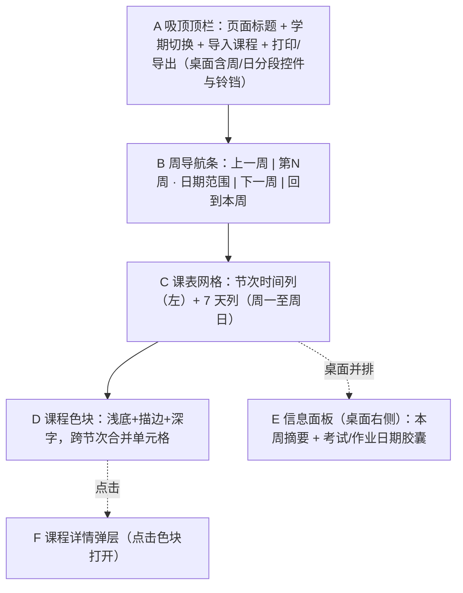
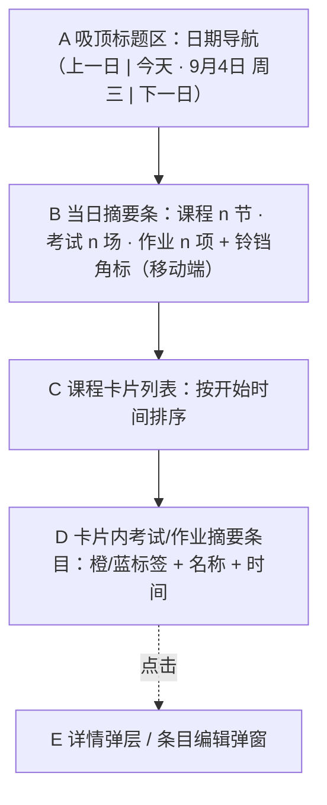
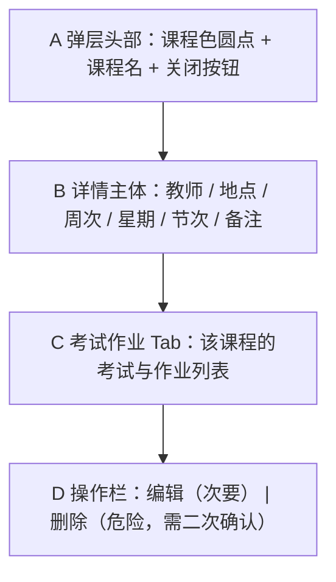
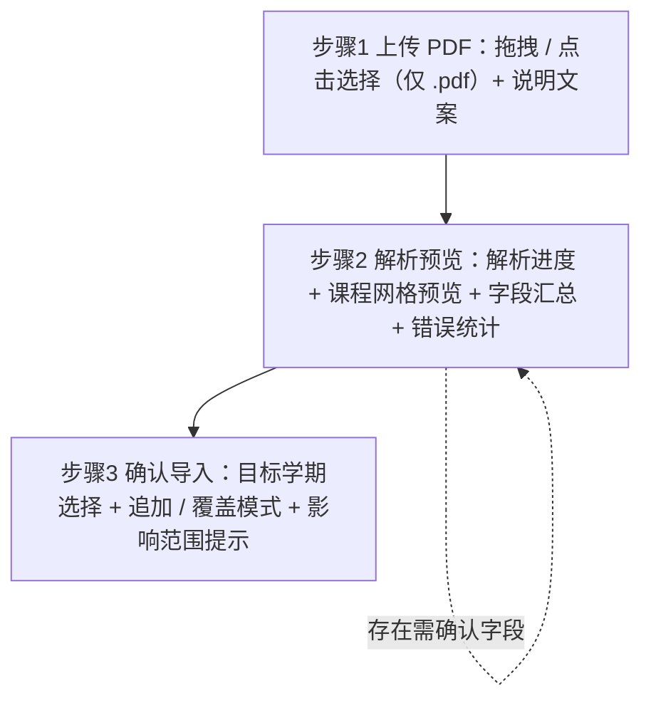
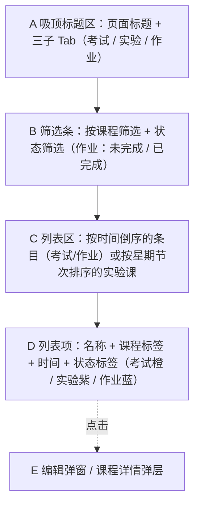
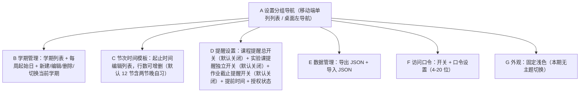
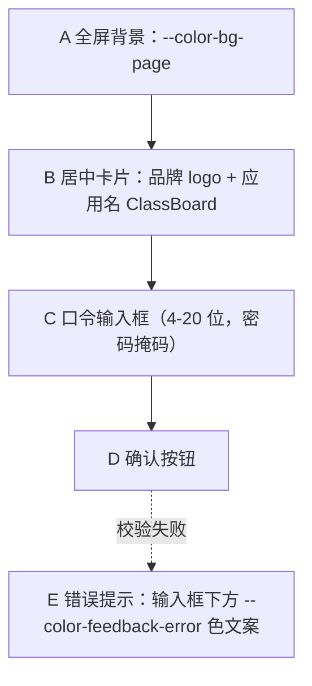

# 课程表 Web 应用 — UI 设计文档

| 项目 | 内容 |
|------|------|
| 产品名称 | 课程表（ClassBoard） |
| 文档版本 | v2.6 |
| 创建日期 | 2026-08-13 |
| 更新说明 | v2.0 依据「清新浅色极简」风格（风格预览 01）定稿视觉体系，全部 token 与布局细节对齐《03-设计语言文档》v2.0；v2.1 依据开发细节确认：移动端底部 Tab 导航、手机始终 7 天、节次可增删（默认 12 节含晚自习）、多学期管理、提醒默认关闭，并补充站内铃铛、课程配色轮询、PWA、打印导出、删学期回退、覆盖导入语义、口令页、横屏策略、手动录入课程（并入导入入口下拉、保存并继续）、实验课类型与独立实验课提醒、考试/实验/作业三子 Tab 分类列表；课程导入改为 PDF 课表导入（正方教务系统导出 PDF，前端解析），移除 Excel 导入。v2.2 依据 2026-08-14 代码盘点同步真实实现：页面清单合并事项页、移动端底部 Tab 实为 4 项（考试/作业并入「事项」）、周导航「未开学/假期」徽标、AppSelect 外部关闭改为文档级 mousedown 监听（无遮罩）；各设计项以 `[已实现]` / `[部分实现]` / `[未实现]` 标注实际落地状态（未实现项见《开发日志》待办）。v2.3 依据会话 22 UI 完善第一批同步：事项页/设置页/口令页/课程编辑删除/颜色选择/保存并继续/单双周开关/备份/Toast/Confirm/打印导出/PWA 全部落地。v2.4 依据会话 23 同步：新增 4.10 时间选择（TimePicker）控件——全项目时间选择统一使用自研 TimePicker（不使用原生 time/datetime-local），节次模板改为竖排双列卡片 + 行内编辑 + 时间冲突校验。v2.5 依据会话 24 同步：新增 4.11 日期选择（DatePicker）控件——全项目日期选择统一使用自研 DatePicker（不使用原生 date），与 TimePicker 同架构（Teleport + fixed 跟随）；桌面顶栏补事项页入口。v2.6 依据会话 25 同步：周视图空白格快捷新增课程、课程详情考试/作业 Tab、骨架屏（4.4）、事项页桌面双栏右侧详情面板（3.5）全部落地 |
| 适用范围 | 全页面与弹层组件（周/日视图、课程详情与编辑、PDF 课表导入流程、考试作业列表、设置页） |
| 上级文档 | 《01-PRD-产品需求文档》《03-设计语言文档》 |

本文档中的一切颜色、间距、字号、圆角、阴影、动效均引用设计语言文档定义的 token（如 `--color-brand`、`--spacing-lg`、`--radius-lg`、`--shadow-card`），实现阶段以《03-设计语言文档》第 10 节的 CSS 自定义属性输出为唯一来源。需要补充 token 之外的数值处标注 `[Expert judgment]`，来自 PRD 的约束标注 `[Data-backed]`。整体视觉与交互细节以被选定的实际参考实现（`examples/style-preview/01-minimal-light.html`）为基准：近白背景、单一主蓝点缀、课程色块浅底描边、柔和分层阴影、克制动效。

## 1. 信息架构与导航

### 1.1 页面清单

| # | 页面 / 弹层 | 类型 | 入口 | 默认设备 | 实现状态 |
|---|------------|------|------|----------|----------|
| 1 | 周课表页 | 页面 | 打开即见（平板/桌面）；移动端底部 Tab「周课表」；桌面顶栏分段「周课表」 | 平板、桌面 | `[已实现]` |
| 2 | 日课表页 | 页面 | 移动端底部 Tab「今天」（默认视图）；桌面顶栏分段「今天」 | 手机 | `[已实现]` |
| 3 | 课程详情弹层 | 弹层 | 点击课程色块 / 课程卡片 | 双端 | `[已实现]`（编辑/删除入口 `[未实现]`，见 3.3） |
| 4 | 课程编辑弹窗 | 弹窗 | 详情弹层内「编辑」（`[已实现]`，会话 22）；周视图空白格点击（`[已实现]`，会话 25）；顶栏「导入课程 → 手动录入」 | 双端 | `[已实现]`（手动录入/详情内编辑/颜色选择/保存并继续/空白格快捷新增） |
| 5 | PDF 课表导入流程 / 手动录入弹窗 | 向导（4 步）或手动录入弹窗 | 顶栏「导入课程」下拉（从 PDF 导入 / 手动录入） | 双端 | `[已实现]`（实际为 4 步：上传→解析预览→确认导入→完成） |
| 6 | 事项页（考试 / 实验 / 作业三子 Tab 分类列表） | 页面 | 移动端底部 Tab「事项」；桌面顶栏入口 | 双端 | `[已实现]`（会话 22：考试/作业真实数据 + 增删改 + 状态筛选 + 完成勾选持久化；会话 25：桌面双栏右侧详情面板） |
| 7 | 设置页 | 页面 | 移动端底部 Tab「设置」；桌面顶栏齿轮 | 双端 | `[已实现]`（会话 22：学期新建/删除/切换/编辑、节次模板增删、提醒设置、单双周开关、备份导出/恢复、访问口令开关，见 3.6） |
| 8 | 访问口令页 | 页面 | 开启口令后未认证进入 | 双端 | `[已实现]`（会话 22，见 3.7） |

> 注：v2.2 依据实现修正——考试/作业不再单列独立页面（旧版 #6/#7），合并为事项页三子 Tab；移动端底部 Tab 实为 4 项（今天 / 周课表 / 事项 / 设置），考试与作业入口并入「事项」页内子 Tab（见 1.2）。

页面依赖关系：周视图与日视图共享同一份课程数据与节次时间模板；课程详情弹层从两个视图均可打开；考试、作业的编辑弹窗可从列表页与课程详情弹层两处进入（PRD 5.7）；各学期数据相互独立，学期切换后全局数据刷新为所选学期。站内提醒入口不单独成页：桌面端为顶栏铃铛按钮（`[已实现]`，数据当前为 mock），移动端铃铛角标 `[未实现]`，点击展开的提醒列表为轻量下拉/弹层。

### 1.2 导航形态

**移动端（`bp-mobile`，< 768px）**

- 顶部为轻量吸顶栏，高 56px（`--z-index-sticky`），背景 `rgba(255,255,255,.92)` + `backdrop-filter: blur(12px)` `[Expert judgment]`，底边框 `--color-border-default`。从左至右：页面标题（`--color-text-primary`、`--font-size-xl`、`--font-weight-bold`）、学期切换入口、右侧「导入课程」下拉（仅课表页显示，展开含「从 PDF 导入」「手动录入」两项）。顶栏不承载周/日视图切换。
- 主导航为底部固定 Tab 栏，共 **4 项**：今天（日视图）、周课表、事项（考试/实验/作业三子 Tab）、设置 `[已实现]`（v2.2 依据实现修正：旧版设计的 5 项——今天/周课表/考试/作业/设置——考试与作业并入「事项」页内子 Tab，见 3.5）。栏背景 `--color-bg-surface`，上边框 `--color-border-default`；每项为图标 + 文字竖排，选中项图标与文字使用 `--color-brand`，未选中项使用 `--color-text-tertiary`；触控目标 ≥ 44×44px（设计语言第 12 节）；栏底适配安全区 `env(safe-area-inset-bottom)` `[Expert judgment]`。站内提醒不占用 Tab 位，入口并入日课表页当日摘要条的铃铛角标（见 3.2，`[未实现]`）。
- 弹层形态统一为底部弹层（`--z-index-modal`、`--shadow-pop`、顶部圆角 `--radius-xl`）。

**桌面端（`bp-desktop`，≥ 1280px）**

- 顶栏吸顶，高 60px，结构与移动端一致（`rgba(255,255,255,.92)` 背景 + `backdrop-filter: blur(12px)`、底边框 `--color-border-default`）；分段控件居中，其右侧为学期下拉/选择器；「导入课程」下拉（含「从 PDF 导入」「手动录入」）使用 `--color-brand` 背景、`--color-text-inverse` 文字、`--shadow-btn` 投影；图标按钮（铃铛/考试/作业/设置等）悬停显示 `--color-bg-hover` 底色，所在页激活或下拉展开时以 `--color-brand-subtle` 底 + `--color-brand` 图标高亮（如设置按钮处于设置页、铃铛展开提醒下拉时）；铃铛按钮在存在未读站内提醒时带角标数字（`--color-feedback-warning` 色，白色文字、`--radius-full` 胶囊），点击展开站内提醒下拉。
- 弹层形态统一为居中弹窗（`--z-index-modal`、`--shadow-pop`、`--radius-xl`）；页面最大内容宽 1440px，主体为「课表主区 + 右侧 296px 信息面板」双栏（第 3.1 节）。

**平板端（`bp-tablet`，768–1279px）**：沿用桌面顶栏结构；信息面板折为三列排布在课表下方；弹窗沿用居中形态。

**学期切换入口（双端）**

- 桌面端位于顶栏分段控件右侧，移动端位于标题栏标题右侧，均为自研下拉组件 `AppSelect`（见 4.9）：展开显示全部学期列表，当前学期项高亮——`--color-brand-subtle` 背景 + `--color-brand` 文字 + 右侧对勾图标。
- 切换学期后全局数据刷新为所选学期：课表、考试、作业、提醒与节次时间模板均随学期切换（每学期拥有独立的节次模板）。

## 2. 响应式规则

| 页面 | `bp-mobile`（< 768px） | `bp-tablet`（768–1279px） | `bp-desktop`（≥ 1280px） |
|------|------------------------|---------------------------|--------------------------|
| 周课表页 | 与桌面一致显示周一至周日 7 天；网格横向滚动（日期列 140px 宽、行高 56px），课表卡片顶部显示「左右滑动查看」提示条；课程色块显示课程名与地点 | 显示 7 列，行高 52px | 显示 7 列，行高 64px；右侧信息面板固定 296px |
| 日课表页 | 默认页；单列时间线卡片 | 单列，最大内容宽 640px | 两栏：左侧课程卡片，右侧信息面板（296px） |
| 课程详情/编辑弹窗 | 底部弹层，占满底部、最大高度 85vh | 底部弹层（沿用移动端） | 居中弹窗，宽 `min(400px,100%)` |
| 导入流程 | 步骤条收为「第 n 步」文字；预览区窄屏可滚动 | 步骤条完整；预览区完整 | 步骤条完整；预览区完整 |
| 考试/作业列表 | 单列卡片；新增按钮在页面标题区；入口为底部 Tab「考试」/「作业」 | 单列卡片，最大内容宽 640px | 左侧列表 + 右侧详情面板（点击项展开） |
| 设置页 | 单列分组列表，逐项展开为面板 | 单列分组列表 | 左侧设置分组导航 + 右侧设置面板 |

断点完全依据视口宽度判定，与设备形态无关：手机横屏后视口宽度 ≥ 768px 时自然进入 `bp-tablet` 断点，切换为平板布局——周课表显示完整 7 列网格、课程详情与编辑改用居中弹窗、日课表单列最大内容宽 640px，无需特殊提示与方向锁定；转回竖屏后恢复移动端布局，页面状态与数据不丢失。

## 3. 页面级设计

### 3.1 周课表页

线框说明：页面自上而下分为三层，桌面端在课表右侧并排信息面板。A 区为吸顶顶栏，桌面承担视图切换（周课表/今天分段控件）与学期切换、导入入口，另含铃铛提醒按钮与打印/导出操作，移动端为轻量标题栏（页面标题 + 学期切换 + 导入），周/日视图切换由底部 Tab 栏承担；B 区为周导航条，是切换周次与过滤单双周的单一操作点；C 区为主体网格，由固定节次时间列与 7 个日期列（周一至周日）构成，D 课程色块悬浮于网格单元格内，点击后打开 F 详情弹层；E 信息面板展示本周摘要与近期考试、作业。网格水平滚动时时间列与表头固定（sticky 定位，`--z-index-sticky` / `--z-index-grid-corner`）。

**区域-组件映射**

| 区域 | 组件 | 关键 Token |
|------|------|-----------|
| A 顶栏 | `TopBar` / `SegSwitch`（桌面） | `--z-index-sticky`；背景 `rgba(255,255,255,.92)` + `backdrop-filter: blur(12px)` `[Expert judgment]`；底边框 `--color-border-default`；分段控件轨道 `--color-bg-subtle`、激活块白底 + `--shadow-card`；学期切换入口 `--color-text-secondary`；导入按钮 `--color-brand` + `--shadow-btn`；图标按钮（铃铛/打印/导出等）悬停 `--color-bg-hover`，铃铛未读角标 `--color-feedback-warning` |
| A′ 底部 Tab 栏（移动端） | `TabBar` | 背景 `--color-bg-surface`、上边框 `--color-border-default`；选中项 `--color-brand`、未选中项 `--color-text-tertiary`；触控目标 ≥ 44×44px（设计语言第 12 节） |
| B 周导航条 | `WeekNav` | 按钮 `--color-bg-surface`、`--radius-sm`、边框 `--color-border-default`、悬停 `--color-border-strong`；标题 `--color-text-primary`、日期 `--color-text-tertiary` |
| C 课表网格 | `WeekGrid` | 网格线 `--color-border-default`；节次时间列/表头/角落底色 `--color-bg-corner`；今天列表头与列背景 `--color-brand-subtle`；时间列单元格显示「第 n 节」+ 起止时间（如 `第 1 节 / 08:00–08:45`），时间列宽 `--tc-w: 84px` |
| D 课程色块 | `CourseBlock` | 底色 `--course-{n}-bg`、描边 `--course-{n}-line`、课程名 `--course-{n}-text`、地点 `--color-text-secondary`；`--radius-sm`、外边距 `--spacing-2xs`、内边距 `--spacing-sm`；悬停 `--shadow-hover` + `translateY(-1px)`；实验课（type=lab）色块右上角叠加紫色「实验」小标签（`--course-3-text` + 白底）`[Expert judgment]` |
| E 信息面板 | `SidePanel` | `--color-bg-surface`、`--radius-lg`、`--shadow-card`、`--spacing-lg` 内边距；桌面 sticky `top: 84px` `[Expert judgment]` |
| F 详情弹层 | `Modal` | `--shadow-pop`、`--radius-xl`、`--z-index-modal` |

**关键交互**

- 默认进入当前周；切换周次后保持所在视图（PRD 5.2）`[已实现]`。
- 手机端与桌面端均显示周一至周日 7 天；节次行高：桌面 64px / 平板 52px / 移动 56px `[Data-backed]`（PRD 5.2）；跨节次课程合并行渲染 `[已实现]`。移动端网格横向滚动，日期列 140px 宽，课表卡片顶部常驻「左右滑动查看本周全部课程 · 点击课程查看详情」提示条 `[已实现]`。
- 周导航条标题区：日期区间 + 「第 N 周」徽标 + 单周/双周徽标；学期外状态徽标——第 0 周（学期未开始）显示「未开学」、学期结束后显示「假期」`[已实现]`（v2.2 补充，对应 PRD 5.8）；「回到本周」按钮在非本周时出现 `[已实现]`。
- 课程色块悬停：`--shadow-card` 增强为 `--shadow-hover` 并 `translateY(-1px)`（`--motion-duration-normal` + `--motion-easing-standard`），按压回位；点击色块打开详情弹层 `[已实现]`；点击空白格直接进入新增课程弹窗，预填星期与起止节次 `[已实现]`（会话 25：每节空白槽 hover 浅底提示，点击打开课程编辑并预填星期/起始节次）。
- 今天列：表头与列背景使用 `--color-brand-subtle`，表头叠加「今天」胶囊徽标（`--color-brand` 底、`--color-text-inverse` 文字、`--radius-full`），星期与日期文字用 `--color-brand-hover` 强调 `[已实现]`（仅当前周生效）。
- 单双周过滤默认开启，当前周为单周只显示单周与全部周课程 `[已实现]`（关闭过滤的开关在设置页 `[已实现]`，会话 22）。
- 两个课程时间重叠时，后导入者向右错位半格显示，色块右上角加 `--color-feedback-warning` 小圆点标记，详情中标注冲突（见第 4 节「冲突错位」）`[已实现]`。
- 周课表页操作区提供「打印」与「导出 PNG」操作，入口同时置于桌面顶栏图标位，操作对象仅限课表网格（第 4.7 节）`[已实现]`（会话 22：周视图操作条「打印」+「导出 PNG」，打印 `@media print` A4 横向仅输出网格与周导航条）。

**信息面板（右侧栏）**

- 桌面端为课表右侧固定 296px 栏，`position: sticky; top: 84px` `[Expert judgment]`，与课表同屏滚动；平板折为三列排布在课表下方；手机单列。卡片间间距 `--spacing-lg`。
- 卡片标题区：28px 圆角图标底（`--color-brand-subtle` 底、`--color-brand` 图标）+ 标题文字（`--font-size-sm`、`--color-text-tertiary`、字距 0.8px `[Expert judgment]`）。
- 本周摘要卡片：统计大数字使用 `--font-size-stat`（26px、`--font-weight-heavy`、负字距），说明文字 `--font-size-sm`、`--color-text-tertiary`；本周进度条高 6px、`--radius-full`，轨道 `--color-bg-subtle`，填充 `--color-brand` 至 `--color-primary-400` 渐变。
- 日期胶囊：`--radius-full`、`--font-size-sm`、`--font-weight-bold`、内边距 `--spacing-xs`，置于条目上方。考试胶囊为橙系（强调文字 `--color-feedback-warning`、底色 `--color-warning-bg`、描边 `--color-warning-line`）；作业胶囊为 warning 浅底（文字 `--color-warning-text`、底色 `--color-warning-bg`、描边 `--color-warning-line`）。
- 条目标题 `--color-text-primary`（`--font-size-body`、`--font-weight-bold`）；元信息（地点、截止时间等）`--font-size-sm`、`--color-text-tertiary`。

**三态表现**

| 状态 | 表现 |
|------|------|
| 空态 | 网格保留，单元格为空；网格上方居中显示 EmptyState：虚线框容器（边框 `--color-border-strong`）内说明文字「还没有课程，先导入或手动添加」，主按钮「从 PDF 导入」（`--color-brand` 背景、`--color-text-inverse` 文字、`--shadow-btn`），次按钮「手动添加课程」 |
| 加载态 | 骨架屏网格：行数取节次模板行数，单元格以 `--color-bg-subtle` 填充，透明度在 0.5–1 间循环 `[Expert judgment]`，容器 `aria-busy="true"` |
| 错误态 | 网格替换为 ErrorState：错误说明 + 「重试」按钮（`--color-feedback-error` 色文字图标）；网络异常时同此表现 |

### 3.2 日课表页

线框说明：A 区为日期导航，左右箭头切换日期，「今天」按钮回当日（实际实现为标题 + 当日课程数，日期导航的上一日/下一日切换 `[未实现]`）；B 区为当日摘要，用数字概览课程、考试、作业数量，移动端右侧常驻铃铛角标入口（未读时显示 `--color-feedback-warning` 色角标数字），点击展开站内提醒下拉/列表，提醒项覆盖上课提醒与作业截止提醒（开启后）——**B 区摘要条与铃铛角标 `[未实现]`**，实际实现为「今日作业」区块（`[已实现]`，会话 22 接入真实数据：当前学期未完成作业中 courseId 为 null 或属于今日课程者，桌面端铃铛下拉承担站内提醒入口）；C 区是按时间排序的课程卡片，卡片头部为课程色圆点与课程名 `[已实现]`；D 区为挂在课程下的考试、作业条目，点击后直接打开对应编辑弹窗（PRD 5.2）`[未实现]`。桌面端 B 区摘要并入右侧信息面板（`[未实现]`）。

**区域-组件映射**

| 区域 | 组件 | 关键 Token |
|------|------|-----------|
| A 日期导航 | `DayNav` | 标题 `--color-text-primary`；手机当日大标题 `--font-size-xl`、桌面 `--font-size-2xl`；日期副标题 `--color-text-tertiary` |
| B 摘要条 | `SummaryBar` | `--color-bg-subtle`、`--radius-md`、`--spacing-md` 内边距；铃铛角标沿用图标按钮样式，未读角标数字 `--color-feedback-warning` 色 |
| C 课程卡片 | `CourseCard` | `--color-bg-surface`、`--shadow-card`、`--radius-lg`、`--spacing-lg` 内边距；左侧课程色圆点（10px，取 `--course-{n}-text` 强调色）、时间 `--color-text-primary` `--font-weight-bold`、地点 `--color-text-secondary`、节次 `--color-text-tertiary` |
| D 摘要条目 | `ExamItem` / `HomeworkItem` | 标签 `--color-feedback-warning`（考试）、`--color-feedback-info`（作业）`[Data-backed]`（PRD 5.7 橙色/蓝色） |

**关键交互**

- 课程卡片按开始时间升序；点击卡片打开课程详情弹层；卡片悬停 `--shadow-card` 增强并 `translateY(-1px)`（`--motion-duration-normal`）`[已实现]`。
- 考试条目显示橙色标签，作业条目显示蓝色标签；作业条目内嵌勾选控件，勾选即标记完成（完成项文字划线，见第 4 节）`[未实现]`（当前仅「今日作业」mock 区块）。
- 移动端经底部 Tab「今天」进入，为打开应用时的默认视图（PRD 第 2 节）；桌面端经顶栏分段「今天」进入 `[已实现]`（首屏默认进入周课表 `/week`，实际以 `/week` 为默认视图，与文档早期「手机默认日视图」的表述不同，v2.2 按实现修正）。
- 铃铛角标（移动端）：点击当日摘要条右侧铃铛展开站内提醒下拉/列表，未读提醒按时间倒序排列，上课提醒与作业截止提醒分别用 `--color-feedback-warning` / `--color-feedback-info` 色图标；点击提醒项跳转对应课程详情弹层或作业编辑弹窗，进入后该条标记已读；已读后可点击角标进入全部提醒列表查看 `[未实现]`（桌面顶栏铃铛下拉骨架已实现、数据为 mock）。

**三态表现**：空态显示「今天没有安排」，虚线框容器（`--color-border-strong`），副文案提示可切换日期查看；加载态为卡片数量对应的骨架卡片（`--color-bg-subtle`）；错误态为 ErrorState + 重试按钮。

### 3.3 课程详情弹层与编辑弹窗

线框说明：详情弹层自上而下为四段。A 区头部左侧 10px 圆点取该课程色板强调色（`--course-{n}-text`），视觉归属课程 `[已实现]`；B 区以键值对形式展示课程全部字段（键 `--color-text-tertiary`、值 `--color-text-body` `--font-weight-medium`，备注值置灰底 `--color-bg-page` + 边框 `--color-border-default` 圆角块）`[已实现]`；C 区用 Tab 聚合该课程的考试与作业（PRD 5.7 编辑入口之一）`[已实现]`（会话 25：考试/作业双 Tab + 数量徽标 + 记录列表，标签橙/蓝区分，空态提示）；D 区为操作栏，删除为危险操作，触发确认对话框 `[已实现]`（会话 22：详情底部「编辑 / 删除」操作栏，删除经确认对话框）。

编辑弹窗复用同一结构：A 区变为「新增课程 / 编辑课程」标题，B 区替换为表单（课程名称、**课程类型（普通课/实验课，默认普通课）**、教师、地点、颜色选择、周次、星期、起止节次、备注）`[已实现]`（颜色选择 `[已实现]`，会话 22：8 色三值色卡，默认按轮询规则预选、可手动改色）；D 区变为「取消 / 保存 / 保存并继续」（`--color-brand` 主按钮、`--shadow-btn`）`[已实现]`。

「保存并继续」用于手动录入：保存成功后表单清空已保存字段，预填上一门课的常用字段（星期、地点、颜色），停留在弹窗内可直接录入下一门 `[已实现]`（会话 22）；「保存」保存后关闭弹窗 `[已实现]`。手动录入直接调用课程创建接口，不经过 PDF 解析与预览流程，与 PDF 导入互相独立 `[已实现]`。编辑模式（从详情进入）加载课程数据整体更新，隐藏「每节课调整」标签页 `[已实现]`。

**区域-组件映射**

| 区域 | 组件 | 关键 Token |
|------|------|-----------|
| 弹窗容器 | `Modal`（桌面）/ `BottomSheet`（移动） | `--color-bg-surface`、`--radius-xl`、`--shadow-pop`、`--z-index-modal`、`--spacing-xl` 内边距 |
| 遮罩 | `Overlay` | `rgba(15,23,42,.42)` + `backdrop-filter: blur(4px)` `[Expert judgment]`，点击遮罩关闭 |
| 头部圆点 | `Dot` | 10×10px、`--radius-sm`、填充取该课程 `--course-{n}-text` 强调色 |
| 表单输入 | `Input` / `Select` / `ColorPicker` | `--color-bg-subtle` 输入框底、`--color-border-default` 边框、`--radius-sm`、`--color-border-focus` 聚焦描边 |
| 颜色选择 | `ColorSwatch` | 8 色 `--course-1` ~ `--course-8`（三值结构 `-bg/-line/-text`），选中项描 `--color-border-focus` 2px 圆环 |
| 删除按钮 | `Button danger` | `--color-feedback-error` 背景、`--color-text-inverse` 文字 |

**关键交互**

- 桌面居中弹窗：宽 `min(400px,100%)`，pop 入场动画（`--motion-duration-slow` 220ms，`translateY(10px) scale(.98)` 至原位 `[Expert judgment]`，`--motion-easing-standard`），遮罩 `rgba(15,23,42,.42)` + `backdrop-filter: blur(4px)` `[Expert judgment]`，焦点锁定在弹窗内（`role="dialog"` + `aria-modal="true"`）。
- 移动端底部弹层从底部滑入（`--motion-duration-normal` + `--motion-easing-standard`），最大高度 85vh，顶部圆角 `--radius-xl`，内容超出可滚动。
- 周次为自定义时显示周列表输入框（如 `1,3,5-8`），校验范围 1–30；起止节次两个下拉联动校验，结束 ≥ 开始，否则按钮下显示 `--color-feedback-error` 色校验文案。
- 保存后立即刷新所在视图（周视图或日视图）；删除触发确认对话框（第 4 节），确认后 Toast「已删除」。
- 颜色选择：新增课程按录入顺序从 `--course-1` ~ `--course-8` 轮询分配，同一课程名自动保持同色；用户在颜色选择区手动改色后仅当前课程生效（规则见第 4.6 节）。

**三态表现**：详情弹层无加载态（数据随弹层打开同步就绪）；编辑弹窗保存中主按钮进入 loading（文字替换为加载指示，`--color-brand` 降透明度）；保存失败时弹窗顶部显示 `--color-feedback-error` 色错误条并保留已填内容。

### 3.4 PDF 课表导入流程

线框说明：导入为**四步向导**（上传 PDF → 解析预览 → 确认导入 → 完成页，v2.2 按实现修正，旧版设计为三步），顶部为步骤条（第 n 步 / 共 4 步，桌面为完整步骤条）。从顶栏「导入课程」下拉选择「从 PDF 导入」进入本流程；选择「手动录入」则直接打开课程编辑弹窗（第 3.3 节，「保存并继续」可连续录入多门，`[未实现]`），两条路径互相独立 `[已实现]`。步骤 1 为上传区，支持拖拽或点击选择，仅接受 .pdf，说明文案「上传教务系统导出的课表 PDF」（正方教务系统）`[已实现]`；步骤 2 前端解析并预览：展示解析进度、解析出的课程网格（10 节 × 7 天预览网格）、字段汇总与错误统计（n 条有效 / m 条需确认），存在错误行时「下一步」禁用 `[已实现]`；步骤 3 选择目标学期并选择追加或覆盖模式，覆盖模式仅清空目标学期的课程，该学期已存在的考试与作业记录保留、其关联课程置空（courseId=null），影响范围提示中注明「考试与作业记录将保留，关联课程置空」`[已实现]`；步骤 4 完成页展示「已成功导入 N 门课程」`[已实现]`。

**区域-组件映射**

| 区域 | 组件 | 关键 Token |
|------|------|-----------|
| 步骤条 | `Steps` | 完成态 `--color-brand`、当前步 `--color-text-body`、未达态 `--color-text-tertiary` |
| 拖拽上传区 | `UploadZone` | 虚线边框 `--color-border-strong`、悬停 `--color-brand-subtle` 底色、`--radius-md` |
| 解析进度条 | `ProgressBar` | 填充 `--color-brand`、轨道 `--color-bg-subtle` |
| 预览表格 | `PreviewTable` | 表头 `--color-bg-subtle`、分隔线 `--color-border-default` |
| 模式选择 | `RadioGroup` | 选中项 `--color-brand` 圆点、说明文字 `--color-text-secondary` |

**关键交互**

- 解析期间步骤 2 显示进度条（`--color-brand` 填充、轨道 `--color-bg-subtle`），容器 `aria-busy`。
- 解析失败提示「PDF 解析失败，请确认是教务系统导出的课表文件」（`--color-feedback-error`），可重新上传。
- 步骤 2 预览区展示解析出的课程网格（可放大查看）、字段汇总与错误统计（n 条有效 / m 条需确认）；需确认字段可在预览页对个别课程的星期、节次、周次直接修正 `[Expert judgment]`，修正后计入有效条数。
- 覆盖模式确认对话框文案：「将删除本学期已导入的全部课程并导入新数据，此操作不可撤销」，另注明「考试与作业记录将保留，关联课程置空」，主按钮 `--color-feedback-error` 色。

**三态表现**：上传前为空态（上传区 + 「上传教务系统导出的课表 PDF」说明）；解析中为加载态（进度条 + `aria-busy`）；解析失败为错误态（错误提示 + 重试上传）。

### 3.5 考试、实验与作业分类列表页（事项页）

线框说明：考试、实验、作业共用一套列表骨架，由 A 区三个子 Tab 切换 `[已实现]`。A 区标题区分三类，右侧为新增按钮（新增按钮按当前子 Tab 变化：考试/作业为对应记录弹窗，实验为新增实验课课程弹窗）`[已实现]`（会话 22）；B 区提供课程与状态筛选（实验子 Tab 无状态筛选）`[部分实现]`（作业 Tab 状态筛选已实现，课程筛选未做）；C 区列表：考试与作业按时间倒序 `[已实现]`（会话 22 接入真实接口），实验子 Tab 展示课程类型=实验课的课程（按星期、节次排序）`[已实现]`；D 列表项展示名称、所属课程标签、时间与状态 `[已实现]`。桌面端点击列表项时，D 展开为右侧详情面板（两栏布局）`[未实现]`。

**区域-组件映射**

| 区域 | 组件 | 关键 Token |
|------|------|-----------|
| 子 Tab | `SegSwitch` | 轨道 `--color-bg-subtle`、激活块白底 + `--shadow-card`、激活文字 `--color-text-primary`、未激活 `--color-text-tertiary` |
| 筛选条 | `FilterBar` | `--color-bg-subtle`、`--radius-md`、文字 `--color-text-tertiary` |
| 列表项 | `ListItem` | `--color-bg-surface`、`--shadow-card`、`--radius-md`、`--spacing-lg` 内边距 |
| 考试标签 | `Tag warning` | `--color-feedback-warning` 底 12% 透明度 + 文字 `[Expert judgment]` |
| 实验标签 | `Tag lab` | 紫色系浅底 + 文字（`--course-3-text` 强调色 + 12% 透明度底）`[Expert judgment]` |
| 作业标签 | `Tag info` | `--color-feedback-info` 底 12% 透明度 + 文字 `[Expert judgment]` |
| 完成勾选 | `Checkbox` | 选中 `--color-feedback-success` 填充、`--radius-sm` |

**关键交互**

- 三子 Tab 默认落在「考试」；切换记忆最近一次选择 `[Expert judgment]`（当前实现默认落在「考试」Tab，切换记忆未实现）。
- 考试与作业均按时间倒序；作业项内嵌勾选控件，勾选后条目文字加删除线（`line-through`），状态即时切换无需保存 `[已实现]`（会话 22：勾选走 `PATCH /api/homework/:id/done` 持久化，文字划线）。
- 实验子 Tab：展示课程类型=实验课的课程列表（课程名、教师、地点、星期与节次），点击条目打开课程详情弹层（第 3.3 节），从详情可编辑或删除该实验课课程 `[已实现]`；列表页「新增」打开课程编辑弹窗并预选「实验课」类型 `[已实现]`（会话 22）。
- 点击条目打开编辑弹窗；考试字段：课程、名称、日期时间、地点、备注；作业字段：课程、名称、截止时间、完成状态、备注 `[已实现]`（会话 22：ExamEditor / HomeworkEditor，课程下拉、datetime-local、完成状态 Switch）。
- 删除条目需二次确认 `[已实现]`（会话 22：确认对话框 danger 操作）。

**三态表现**：空态按子 Tab 区分——考试空态「还没有考试安排」、实验空态「还没有实验课」、作业空态「还没有作业」，均附对应「新增」主按钮；加载态为骨架列表；错误态为 ErrorState + 重试。

### 3.6 设置页

线框说明：设置页分六组。A 区为分组导航，移动端为单列分组列表逐项展开，桌面为左侧分组导航 + 右侧设置面板 `[部分实现]`（当前为单页六个 panel：学期 / 节次时间模板 / 单双周过滤 / 提醒 / 数据管理 / 访问口令 / 外观，无桌面左导航）。B 至 G 为各设置面板：B 学期管理展示学期列表（学期名称、起止日期、当前学期标记），支持新建、编辑、删除与切换当前学期 `[已实现]`（会话 22：新建含每周起始日选择，删除经确认对话框并自动切换当前学期，行内编辑起止日期）；C 节次时间模板为可编辑起止时间列表，默认 12 节（含两节晚自习），行数可增删，删除行后节次序号自动重排（校验结束晚于开始）`[已实现]`（会话 22：尾部添加 time 输入 + 每行删除）；D 提醒设置含课程提醒总开关（默认关闭，首次使用时经引导开启）、实验课提醒独立开关（默认关闭，仅对课程类型=实验课的课程生效）、提醒时机（每节课 / 仅当天首课）、提前分钟数（5/10/15/30）与浏览器通知授权状态提示，作业截止提醒为独立开关（默认关闭）`[已实现]`（会话 22：三组开关 + AppSelect 选项 + 授权按钮，保存写回 `/api/settings`）；E 数据管理提供 JSON 导出与导入 `[已实现]`（会话 22：导出下载 `classboard-backup-*.json`，导入前确认「覆盖当前全部数据」）；F 访问口令为 4–20 位 `[已实现]`（会话 22：开关 + 口令输入，开启/关闭均需口令，`accessEnabled` 状态实时反映）；G 外观固定浅色，`color-scheme: light` 锁定，本期不提供主题切换（设计语言第 11 节）`[已实现]`。

**区域-组件映射**

| 区域 | 组件 | 关键 Token |
|------|------|-----------|
| 分组导航 | `SideNav`（桌面）/ 列表（移动） | 激活项 `--color-brand-subtle` 底色 + `--color-brand` 文字、`--radius-md` |
| 表单面板 | `Panel` | `--color-bg-surface`、`--radius-md`、`--shadow-card`、`--spacing-xl` 内边距 |
| 学期管理 | `SemesterList` / `SemesterDialog` | 当前学期标记 `--color-brand` 胶囊（`--radius-full`）；列表项 `--color-bg-surface` + `--shadow-card` + `--radius-md`；删除确认沿用 4.3 确认对话框 |
| 时间输入 | `TimeInput` | `--font-family-sans`、等宽数字 `tabular-nums`、`--color-bg-subtle` 底、`--radius-sm` |
| 开关 | `Switch` | 开启 `--color-brand`、关闭 `--color-bg-subtle`、`--radius-full` 轨道 |
| 授权提示 | `Alert` | `--color-feedback-warning` 图标 + `--color-bg-subtle` 底色 |

**关键交互**

- 学期管理：新建学期填写名称与起止日期；编辑可修改名称、起止日期与每周起始日；删除学期弹出确认对话框（见 4.3），提示「将清除该学期全部课程、考试与作业数据，此操作不可撤销」，确认文案不因删除对象变化；删除的若是当前学期，系统自动切换到剩余学期中起始日期最近的一个，删除后无任何学期时课表区域显示空态并引导新建学期；切换当前学期后课表、考试、作业与提醒全局刷新为所选学期，节次时间模板随学期独立切换。
- 学期起止日期与每周起始日修改后，周次计算即时生效；节次时间模板新增一行在末尾追加空行并自动编号，删除一行后其余节次序号自动重排，起止时间校验结束晚于开始；修改节次时间后课表渲染与提醒同步更新（PRD 5.4）。
- 提醒默认关闭，首次使用提醒功能时经引导开启浏览器通知授权；课程提醒与实验课提醒为两个独立开关（实验课提醒仅对课程类型=实验课的课程生效），作业截止提醒为独立开关，默认均关闭。
- 导出 JSON 直接下载文件；导入 JSON 前二次确认「将覆盖当前全部数据」。
- 口令开启后，未认证会话进入应用前先过口令页（页面设计见 3.7）；口令以哈希存储，无找回机制，设置页常驻提示。
- 外观固定浅色，本期无主题切换；设置页不提供主题切换控件，也不持久化任何主题偏好。

**三态表现**：设置页为纯配置页，无列表加载态；数据管理导入出错时错误条显示 `--color-feedback-error` 文案（如「文件格式无效」）；节次时间校验失败时对应行标红并阻止保存。

### 3.7 访问口令页

> **实现状态：`[已实现]`**（v2.3 标注，会话 22）——AccessView 全屏居中卡片（品牌 logo + 应用名 + 口令输入 + 确认按钮 + 错误提示），App 层 `accessRequired` 拦截（context 返回 `accessRequired` 时仅渲染口令页），校验成功后重新 bootstrap 进入应用；错误文案保留至下次提交。

线框说明：口令页为全屏居中卡片布局，双端形态一致。A 区为整页背景 `--color-bg-page`；B 区卡片垂直水平居中，使用 `--color-bg-surface` 底色 + `--shadow-pop` 投影 + `--radius-xl` 圆角，自上而下依次为品牌 logo（48px 圆角图标底 `--color-brand-subtle` + `--color-brand` 图标）与「ClassBoard」应用名；C 区口令输入框对齐表单规范（`--color-bg-subtle` 输入框底、`--color-border-default` 边框、`--radius-sm`、聚焦 `--color-border-focus` 描边），密码掩码显示，长度校验 4–20 位；D 区确认按钮使用 `--color-brand` 背景、`--color-text-inverse` 文字、`--shadow-btn` 投影；口令校验失败时 E 区在输入框下方显示 `--color-feedback-error` 色文案（如「口令不正确」），输入框边框同步标红。移动端竖屏保持卡片居中，卡片宽度适配视口并适配安全区，不启用底部弹层。

**区域-组件映射**

| 区域 | 组件 | 关键 Token |
|------|------|-----------|
| 页面背景 | `Page` | `--color-bg-page`、flex 居中布局 |
| 卡片 | `Card` | `--color-bg-surface`、`--shadow-pop`、`--radius-xl`、`--spacing-xl` 内边距、宽 `min(360px, 100%)`、两侧视口留白 `--spacing-xl` `[Expert judgment]` |
| 品牌区 | `Logo` / 标题 | 图标底 `--color-brand-subtle` + 图标 `--color-brand`；应用名 `--color-text-primary`、`--font-size-xl`、`--font-weight-bold` |
| 口令输入 | `PasswordInput` | `--color-bg-subtle` 输入框底、`--color-border-default` 边框、`--radius-sm`、聚焦 `--color-border-focus` |
| 确认按钮 | `Button primary` | `--color-brand` 背景、`--color-text-inverse` 文字、`--shadow-btn`、`--radius-md` |
| 错误提示 | `FieldError` | `--color-feedback-error` 色文案与输入框描边 |

**关键交互**

- 口令通过后进入应用主界面；校验失败不清空已输入内容，错误文案保留至下次提交。
- 提交中确认按钮进入 loading（`--color-brand` 降透明度）；错误文案自动播报（`role="alert"`）。
- 未开启口令时此页不出现；开启口令后，未认证会话进入应用前先过此页。

## 4. 全局交互规范

### 4.1 通用动效

所有动效时长 ≤ 500ms（设计语言第 7 节），统一使用 `--motion-easing-standard` 曲线：

| 场景 | 动效 | Token |
|------|------|-------|
| 页面元素入场 | fadeUp：`translateY(8px)` + `opacity 0` 过渡到原位，元素分批错峰（`animation-delay` 30ms / 90ms / 140ms / 190ms / 240ms / 300ms） | `--motion-duration-reveal` |
| 弹窗/底部弹层进出 | 桌面 pop（`translateY(10px) scale(.98)` 缩放淡入）、移动底部滑入 | `--motion-duration-slow`（桌面）/ `--motion-duration-normal`（移动） |
| 视图切换（周/日） | 分段控件按钮等宽（104px），激活块（`--color-bg-surface` + `--shadow-card`）在原地背景/文字/字重过渡，托盘不左右移动；全局 `scrollbar-gutter: stable` 保证滚动条占位恒定，避免页面间视口宽度变化引发居中元素偏移 | `--motion-duration-normal` |
| 课程色块悬停/按压 | `--shadow-card` 增强为 `--shadow-hover` + `translateY(-1px)` | `--motion-duration-normal` |
| 列表项勾选完成 | 文字划线滑入 | `--motion-duration-fast` |

开启系统「减少动态效果」（`prefers-reduced-motion`）时全部动画禁用，弹层改为瞬时显示。

### 4.2 Toast 轻提示

> **实现状态：`[已实现]`**（v2.3 标注，会话 22）——全局 ToastHost（`components/common/ToastHost.vue`）：顶部居中（`--topbar-h` 下方）、四类语义色左条、3s 自动消失、fast 动效、层级 `--z-index-modal`；API 为 `toast(msg, type)`（`utils/ui.ts`）。

- 定位：页面顶部居中或底部弹层上方（移动端），层级 `--z-index-modal`。
- 四类语义色：成功 `--color-feedback-success`、警示 `--color-feedback-warning`、错误 `--color-feedback-error`、信息 `--color-feedback-info`；底色为 `--color-bg-surface`，左侧语义色图标 + `--color-text-body` 文字。
- 出现与消失各 `--motion-duration-fast`，自动消失时长 3s `[Expert judgment]`；`role="status"` 播报。
- 适用场景：保存成功「已保存」、导入成功「已导入 n 门课程」、删除「已删除」、口令错误「口令不正确」。

### 4.3 确认对话框

> **实现状态：`[已实现]`**（v2.3 标注，会话 22）——全局 ConfirmHost（`components/common/ConfirmHost.vue`），Promise 式 `confirm({title, desc, danger, confirmText})`；危险操作确认按钮 `--color-feedback-error` 背景，桌面居中弹窗 / 移动端底部弹层。

- 危险操作（删除课程/考试/作业、删除学期、覆盖导入、导入 JSON 覆盖）统一经确认对话框二次确认。
- 结构：标题（`--font-weight-bold`、`--color-text-primary`）+ 影响范围说明（`--color-text-secondary`）+ 操作栏「取消 / 确认」；确认按钮对破坏性操作使用 `--color-feedback-error` 背景。
- 焦点进入后锁定在对话框内；确认后执行操作并 Toast 反馈。

### 4.4 骨架屏

> **实现状态：`[已实现]`**（v2.6 标注，会话 25）——通用 Skeleton 组件（`components/common/Skeleton.vue`）三形态：`grid`（周课表网格骨架，12 节 × 7 列）/ `card`（列表卡片骨架）/ `line`（详情字段行）；接入周视图（remote 已连接且周数据未就绪时）与事项页（考试/作业加载中）；浅底 `--color-bg-subtle` 呼吸占位 + `aria-busy`，响应 `prefers-reduced-motion`。

- 首次加载与刷新时展示，替代真实内容，容器 `aria-busy="true"`。
- 填充色 `--color-bg-subtle`，透明度 0.5–1 循环脉冲 `[Expert judgment]`，时长对齐 `--motion-duration-slow` 区间；圆角沿用对应内容的 `--radius-md` / `--radius-sm`。
- 按页面形态定制：周课表为网格骨架（行数 = 节次模板行数）、日课表与列表页为卡片骨架、详情弹层为字段行骨架。

### 4.5 课程色块冲突错位显示

- 触发条件：同一时段（同日、同节次区间重叠）存在两门及以上课程（PRD 5.2）`[已实现]`。
- 错位规则：按导入顺序，后导入者（实际实现按 id 升序分组，id 大者）在其所在列内向右偏移半格（列宽 50% `[Expert judgment]`），与既有课程并排 `[已实现]`；冲突课程的色块右上角叠加 8px 直径 `--color-feedback-warning` 圆点标记 `[Expert judgment]`，色块 `--radius-sm` 不变 `[已实现]`。
- 详情弹层中冲突课程以警示条标注「与 XX 课程时间重叠」`[未实现]`；删除其中一门后，剩余课程自动回位（`--motion-duration-fast`）`[未实现]`（课程删除入口整体未做）。
- 课程色块恒显示课程名文本，不以颜色作为区分课程的唯一手段（设计语言第 12 节）`[已实现]`。

### 4.6 课程颜色分配

- 新增课程时按录入顺序从 8 色轮询分配（`--course-1` ~ `--course-8`），轮询序号在同一学期内按新建时间累计；同一课程名的课程自动保持同色，不占用新的轮询序号 `[已实现]`（`pickCourseColor`，前端 scheduleStore）。
- 用户可在课程编辑弹窗「颜色选择」区手动改色，改色仅作用于当前课程，后续新增同名课程仍跟随轮询默认色 `[已实现]`（会话 22：8 色三值色卡，选中描边 `--color-border-focus` 圆环）。
- 颜色区分布依赖视觉层级：色块浅底描边 + 课程名深字，改色不影响可读性（设计语言第 12 节）`[已实现]`。

### 4.7 课表打印与导出 PNG

> **实现状态：`[已实现]`**（v2.3 标注，会话 22）——周视图操作条「打印」（`window.print()`，`@media print` A4 横向，仅输出课表网格与周导航条，隐藏顶栏/底部栏/信息面板/提示条/操作条）与「导出 PNG」（`utils/exportPng.ts`：DOM→SVG foreignObject→canvas 2x 高清→下载，操作对象仅限课表网格）。

- 周视图提供「打印」与「导出 PNG」两个操作，入口位于桌面顶栏图标位与周课表页操作区，双端均可使用。
- 打印：`@media print` 打印样式仅输出课表网格（周导航条保留以标示周次），隐藏顶栏、底部 Tab 栏、信息面板与提示条，A4 横向（`size: A4 landscape`）适配，内容超一页时按周分页 `[Expert judgment]`。
- 导出 PNG：将当前周课表网格绘制为 PNG 图片并下载，导出前可确认导出范围（当前周），导出内容与打印一致，不含应用外壳元素。
- 打印与导出均即时反映当前学期的节次模板与课程配色，不等待数据刷新。

### 4.8 PWA 与主屏幕

> **实现状态：`[已实现]`**（v2.3 标注，会话 22）——`public/manifest.webmanifest`（name/theme_color `#ffffff`/background `#f6f7f9`/display standalone/start_url `/week`），192/512 PNG 图标（`public/icon-192.png`、`icon-512.png`），`index.html` 注册 manifest + apple-touch-icon。

- 提供 Web App Manifest：应用名 ClassBoard，图标提供 192px 与 512px 两档，`theme_color` 使用 `--color-bg-surface`（与页面近白底色一致），`display` 设为 standalone，支持添加到主屏幕后全屏打开。
- 不做离线缓存：不注册 Service Worker 缓存策略，应用依赖在线访问（家庭局域网场景基本在线）；离线时提示网络不可用。
- 桌面浏览器直接访问不受 PWA 配置影响，功能与表现与普通网页一致。

### 4.9 下拉选择（Select）控件

**选型**：一律使用自研组件 `AppSelect`（`frontend/src/components/common/AppSelect.vue`），不使用原生 `<select>`。原生 select 的弹出面板是操作系统控件，纯 CSS 无法样式化，与整体 UI 风格不一致。

**结构**：触发器按钮（当前值 + 右侧 chevron 箭头）+ 展开面板（选项列表）。点击外部关闭：v2.2 依据实现修正——不使用全屏透明遮罩（遮罩在弹窗 Teleport/模态层内接不住点击，见开发日志会话 16），改为**文档级 `mousedown` 监听**，点击组件外部即关闭；面板入场 `opacity 0 → 1` + `translateY(-4px) → 0`。

**触发器**：

- 默认紧凑型高 32px（顶栏内嵌场景），表单场景 `size="md"` 高 40px；`--color-bg-surface` 底、`--color-text-body` 文字、`--color-border-default` 边框、`--radius-md` 圆角、`--font-size-md`。
- hover：边框 `--color-border-strong`；展开（`.is-open`）：边框 `--color-border-focus` + `outline: 2px solid var(--color-border-focus)`。
- chevron 箭头 `--color-text-tertiary` 色，展开时旋转 180°（`--motion-duration-fast`）。

**面板**：

- `absolute` 定位触发器下方 6px，`min-width: 100%`（最长 280px），`--color-bg-surface` 底 + `--color-border-default` 边框 + `--radius-md` + `--shadow-pop`，`padding: var(--spacing-xs)`，层级 `--z-index-float`。
- 入场：`opacity 0 → 1` + `translateY(-4px) → 0`（`--motion-duration-normal`）；出场仅透明度（`--motion-duration-fast`）。
- 选项（`.select-option`）：`--font-size-sm`、`--radius-sm`，hover 底色 `--color-bg-subtle`；选中项（`.is-selected`）`--color-brand-subtle` 背景 + `--color-brand` 文字 + `--font-weight-medium` + 右侧对勾图标。

**无障碍**：触发器 `role="combobox"` + `aria-expanded`；面板 `role="listbox"`、选项 `role="option"` + `aria-selected`；面板与触发器均通过 `aria-label` 命名。

**使用范围**：学期切换（顶栏双端）、课程编辑弹窗的起止节次（见 3.3）、后续手动录入/设置中的枚举选择一律复用 `AppSelect`。

### 4.10 时间选择（TimePicker）控件

**选型**：一律使用自研组件 `TimePicker`（`frontend/src/components/common/TimePicker.vue`），不使用原生 `<input type="time">`。原生时间选择器的弹出面板是操作系统控件，弹出位置不受页面布局控制（易错位）、无法样式化，与整体 UI 风格不一致。

**结构**：触发器按钮（当前时间 + 时钟图标）+ 弹出面板（小时 / 分钟双列滚动列表）+ 文档级 `mousedown` 外部关闭（与 AppSelect 一致，无遮罩）。

**触发器**：

- 尺寸 `sm` 32px（卡片内嵌，如设置页节次模板）/ `md` 40px（表单，如考试/作业编辑弹窗）；宽 `sm` 92px / `md` 110px。
- `--color-bg-surface` 底、`--color-text-body` 文字、`--color-border-default` 边框、`--radius-sm` 圆角、`--font-size-md`、等宽数字 `tabular-nums`。
- hover：边框 `--color-border-strong`；展开（`.is-open`）：边框 `--color-border-focus` + `outline: 2px solid var(--color-border-focus)`。
- 时钟图标 `--color-text-tertiary` 色，展开时旋转 180°（`--motion-duration-fast`）。
- 空值显示占位文字 `--color-text-tertiary`。

**面板**：

- `absolute` 定位触发器下方 6px，宽 132px，`--color-bg-surface` 底 + `--color-border-default` 边框 + `--radius-md` + `--shadow-pop`，`padding: var(--spacing-xs)`，层级 `--z-index-float`。
- 小时列（00–23）与分钟列（00/05/…/55，5 分钟步进）双列滚动（列高 168px，细滚动条），中间冒号分隔。
- 选项（`.tp-opt`）：高 28px、`--font-size-md`、等宽数字；hover 底色 `--color-bg-subtle`；选中项（`.is-selected`）`--color-brand-subtle` 背景 + `--color-brand` 文字 + `--font-weight-medium`。
- 打开时自动把当前选中项滚动到列中央（仅滚动列容器，不影响页面）。
- 入场：`opacity 0 → 1` + `translateY(-4px) → 0`（`--motion-duration-normal`）。

**无障碍**：触发器 `role="combobox"` + `aria-expanded`；面板 `role="dialog"` + `aria-label`；小时/分钟列为 `role="listbox"`、选项 `role="option"` + `aria-selected`；Esc 关闭。

**使用范围**：设置页节次时间模板（编辑/新建）、考试编辑弹窗考试时间、作业编辑弹窗截止时间（与日期 `input type="date"` 组合为「日期 + 时间」两段式）；项目内任何时间选择一律复用 `TimePicker`。

**时间冲突校验**（节次模板）：编辑/新建节次保存时校验起止时间合法（结束须晚于开始）且与其他节次时间区间不重叠；相邻节次允许首尾相接（`endA == startB` 不算冲突）；冲突时卡片内红字提示冲突节次并阻止保存。

### 4.11 日期选择（DatePicker）控件

**选型**：一律使用自研组件 `DatePicker`（`frontend/src/components/common/DatePicker.vue`），不使用原生 `<input type="date">`。原生日期选择器的弹出日历是操作系统控件，弹出位置不受页面布局控制、无法样式化，与整体 UI 风格不一致。

**结构**：触发器按钮（当前日期 + 日历图标）+ 弹出日历面板（月份导航 + 星期表头 + 日期网格）+ 文档级 `mousedown` 外部关闭（与 TimePicker 一致）；面板经 **Teleport 渲染到 body** 并以 `fixed` 定位跟随触发器（与 TimePicker 同架构，规避层叠/裁剪遮挡），滚动/缩放窗口时面板跟随。

**触发器**：

- 尺寸 `sm` 32px（卡片内嵌，如设置页学期起止日期）/ `md` 40px（表单，如考试/作业编辑弹窗）；宽 `sm` 128px / `md` 150px。
- `--color-bg-surface` 底、`--color-text-body` 文字、`--color-border-default` 边框、`--radius-sm` 圆角、`--font-size-md`、等宽数字 `tabular-nums`；hover 边框 `--color-border-strong`；展开时边框 `--color-border-focus` + `outline: 2px`。
- 日历图标 `--color-text-tertiary`；空值显示占位文字 `--color-text-tertiary`。

**日历面板**：

- 宽 264px，`--color-bg-surface` 底 + `--color-border-default` 边框 + `--radius-md` + `--shadow-pop`，`padding: var(--spacing-md)`，层级 9999（Teleport 顶层）。
- 头部：上一月 / 下一月图标按钮（28×28，hover `--color-bg-subtle`）+ 年月标题（`--font-size-sm`、`--font-weight-medium`、等宽数字）。
- 星期表头：一~日（`--font-size-xs`、`--color-text-tertiary`，周一为每周起始）。
- 日期网格：7 列，日按钮 30px 高；hover `--color-bg-subtle`；**今天** `--color-brand` 加粗；**选中日** `--color-brand` 底 + `--color-text-inverse` 字；超出 min/max 范围的日期置灰不可选（`--color-text-tertiary` + 0.45 透明度）。
- 打开时定位到选中日期所在月（无选中则今天所在月）；点击日期即选中并关闭。
- 入场：`opacity 0 → 1` + `translateY(-4px) → 0`（`--motion-duration-normal`）。

**无障碍**：触发器 `role="combobox"` + `aria-expanded`；面板 `role="dialog"` + `aria-label`；日期网格 `role="grid"`、日按钮 `role="gridcell"` + `aria-selected`；月份导航按钮 `aria-label`（上个月/下个月）；Esc 关闭。

**使用范围**：设置页学期新建/编辑的起止日期、考试编辑弹窗考试日期、作业编辑弹窗截止日期（与 TimePicker 组合为「日期 + 时间」两段式）；项目内任何日期选择一律复用 `DatePicker`。
